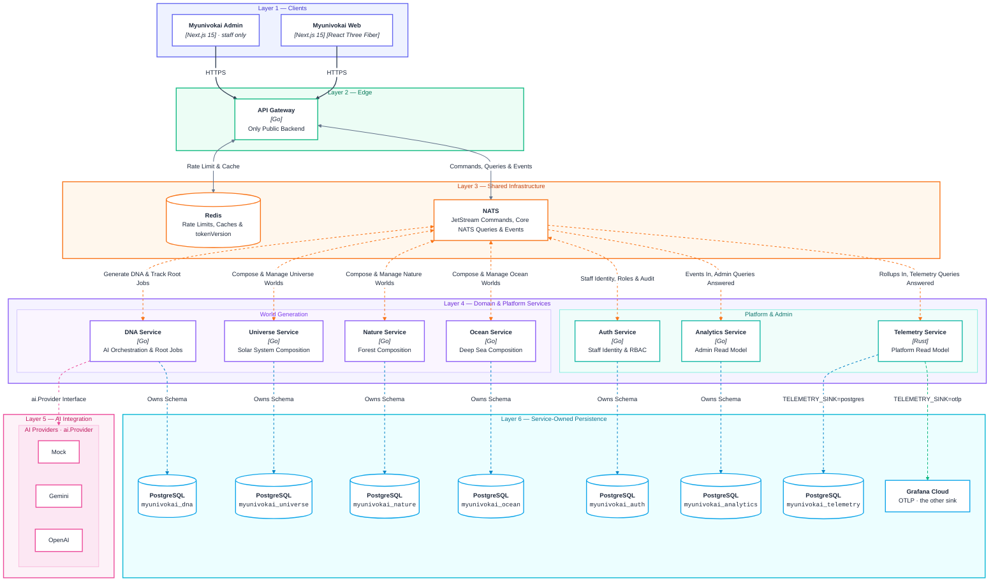
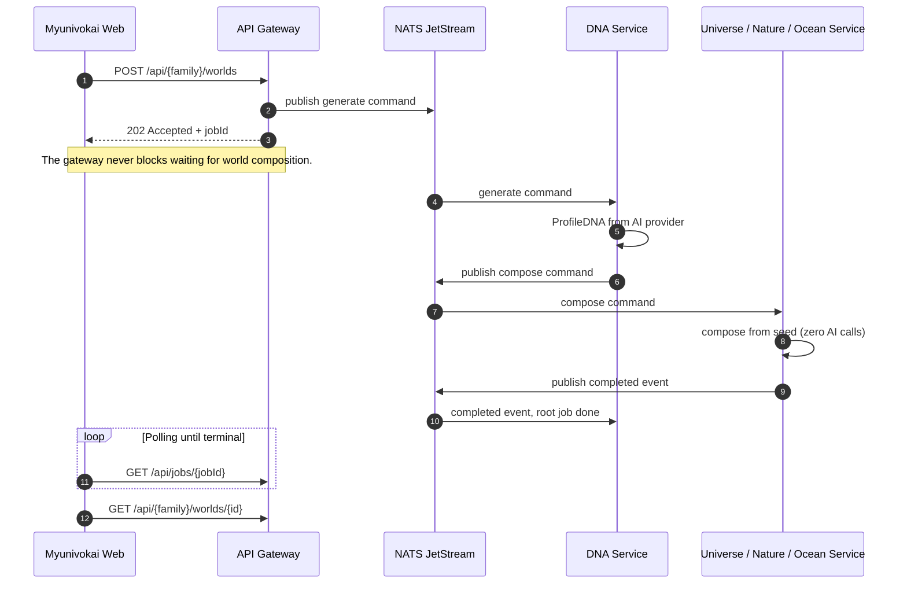

# Myunivokai

> *Have you ever wondered what a world built from who you are would look like?*  
> **Myunivokai** (*My Universe? OK, AI!*) transforms your personality into an AI-generated 3D world that's uniquely yours.

Describe yourself once. The platform synthesizes a canonical **ProfileDNA** from your narrative, then deterministically composes an interactive 3D scene — a **Universe** (Solar System), **Nature** (Forest), or **Ocean** (Deep Sea) — rendered directly in your browser with procedural ambient soundscapes.

---

## Architecture



| Line style | Meaning |
| --- | --- |
| **Solid dark** | HTTPS (Clients → Gateway) |
| **Solid grey** | Rate limit, cache & NATS dispatch (Gateway ↔ Redis / NATS) |
| **Dotted orange** | Commands, queries & events (NATS ↔ services) |
| **Dotted pink** | AI provider call (`dna-service` → `ai.Provider`) |
| **Dotted blue** | Owns schema (service → PostgreSQL) |
| **Dashed green** | Telemetry sink (`TELEMETRY_SINK=otlp` → Grafana Cloud) |

- **Strict Data Boundaries**: Each service owns its own PostgreSQL database; no service ever queries another's tables directly.
- **Single Public Entry**: Only `api-gateway` is exposed to the internet. NATS, Redis, and all domain services remain private.
- **Async Workers**: Domain services are headless NATS workers with no public HTTP business API.
- **CQRS Read Models**: `analytics-service` and `telemetry-service` are read models that consume events from NATS and answer queries without waking or waiting on domain services.
- **AI Isolation**: AI providers sit strictly behind `dna-service`. All world generation (`universe`, `nature`, `ocean`) is 100% deterministic mathematical composition.

| Service | Responsibility |
| --- | --- |
| `services/api-gateway` | **[Go]** The only public-facing backend. Validates input, dispatches commands to NATS, returns `202 + jobId`, and manages Redis caching. |
| `services/dna-service` | **[Go]** Handles AI orchestration (`ai.Provider`), root generation jobs, immutable `ProfileDNA` versioning, and the transactional outbox. |
| `services/universe-service` | **[Go]** Computes deterministic solar-system worlds and variants from a seed. No AI calls. |
| `services/nature-service` | **[Go]** Computes deterministic forest worlds and variants from a seed. No AI calls. |
| `services/ocean-service` | **[Go]** Computes deterministic deep-sea worlds from a seed and depth curve. No AI calls. |
| `services/auth-service` | **[Go]** Staff identity: authentication, token rotation, RBAC, and audit logs (Core NATS request-reply). |
| `services/analytics-service` | **[Go]** The admin CQRS read model. Consumes JetStream events and answers admin metrics/projection queries. |
| `services/telemetry-service` | **[Rust]** The platform read model. Ingests minute-by-minute rollups from the gateway, storing metrics in Postgres or forwarding to Grafana Cloud. |

---

## Database Architecture & ERD

Myunivokai strictly enforces the **Database-per-Service** pattern. Each microservice manages its own schema via explicit SQL migrations.

### 1. AI & Generation Engine (`myunivokai_dna`)

Chịu trách nhiệm quản lý prompt đầu vào của người dùng, phân tích AI và tạo ra bản **ProfileDNA** bất biến theo phiên bản (*versioning*).

```text
+--------------------------+ 1      N +--------------------------+
| PROFILES                 |----------| DNA_VERSIONS             |
+--------------------------+          +--------------------------+
| * id (PK)                |          | * id (PK)                |
|   raw_input              |          |   profile_id (FK)        |
|   created_at             |          |   source_job_id (UK)     |
|   updated_at             |          |   version_number         |
+--------------------------+          |   profile_dna            |
             | 1                      |   created_at             |
             |                        +--------------------------+
             |                                     | 1
             | N (has many)                        |
+--------------------------+                       |
| GENERATION_JOBS          |-----------------------+ 0..1 (produces)
+--------------------------+
| * job_id (PK)            |
|   family                 |
|   profile_id (FK)        |
|   status                 |
|   dna_version_id (FK)    |
|   world_id               |
|   error_code             |
|   error_message          |
|   created_at             |
|   completed_at           |
+--------------------------+
             | 1
             |
             | N (tracks)
+--------------------------+
| AI_GENERATION_ATTEMPTS   |
+--------------------------+
| * id (PK)                |
|   job_id (FK)            |
|   provider               |
|   model                  |
|   input_hash             |
|   request_json           |
|   response_json          |
|   usage_json             |
|   latency_ms             |
|   status                 |
|   created_at             |
+--------------------------+

+--------------------------+          +--------------------------+
| INBOX_MESSAGES           |          | OUTBOX_MESSAGES          |
+--------------------------+          +--------------------------+
| * message_id (PK)        |          | * id (PK)                |
|   subject                |          |   message_id (UK)        |
|   job_id                 |          |   subject                |
|   processed_at           |          |   payload                |
+--------------------------+          |   published_at           |
                                      +--------------------------+
```

### 2. World Families Engine (`myunivokai_universe`, `myunivokai_nature`, `myunivokai_ocean`)

Mỗi world family (`universe`, `nature`, `ocean`) sở hữu một database riêng có cấu trúc bảng chuẩn hóa 1:1:

```text
+--------------------------+
| WORLDS                   |
+--------------------------+
| * id (PK)                |          +--------------------------+
|   source_job_id (UK)     | 1      N | WORLD_VARIANTS           |
|   profile_id             |----------|                          |
|   dna_version_id         |          +--------------------------+
|   nickname               |          | * id (PK)                |
|   role                   |          |   world_id (FK)          |
|   visual_intent          |          |   variant_no             |
|   dna_snapshot           |          |   seed                   |
|   archetype              |          |   config                 |
|   scene_name             |          |   thumbnail_url          |
|   quote                  |          |   is_selected            |
|   revision               |          |   created_at             |
|   selected_variant_id(FK)|<-+       +--------------------------+
|   created_at             |  |                    |
|   updated_at             |  | 0..1               | 1 (selected)
+--------------------------+  +--------------------+
             | 1
             |
             | 0..1 (shares)
+--------------------------+
| WORLD_SHARES             |
+--------------------------+
| * id (PK)                |
|   world_id (FK)          |
|   share_slug (UK)        |
|   created_at             |
+--------------------------+

+--------------------------+          +--------------------------+
| INBOX_MESSAGES           |          | OUTBOX_MESSAGES          |
+--------------------------+          +--------------------------+
| * message_id (PK)        |          | * id (PK)                |
|   subject                |          |   message_id (UK)        |
|   job_id                 |          |   subject                |
|   processed_at           |          |   payload                |
+--------------------------+          |   published_at           |
                                      +--------------------------+
```

### 3. Staff Identity & RBAC (`myunivokai_auth`)

```text
+--------------------------+ 1      N +--------------------------+ N      1 +--------------------------+
| ACCOUNTS                 |----------| ACCOUNT_ROLES            |----------| ROLES                    |
+--------------------------+          +--------------------------+          +--------------------------+
| * id (PK)                |          | * account_id (PK, FK)    |          | * id (PK)                |
|   email (UK)             |          | * role_id (PK, FK)       |          |   name (UK)              |
|   password_hash          |          +--------------------------+          |   audience               |
|   kind                   |                                                |   is_system              |
|   is_super_admin         |          +--------------------------+ 1      N |   created_at             |
|   disabled               |          | PERMISSIONS              |----------+--------------------------+
|   token_version          |          +--------------------------+          | ROLE_PERMISSIONS         |
|   failed_attempts        |          | * id (PK)                |          +--------------------------+
|   locked_until           |          |   codename (UK)          |          | * role_id (PK, FK)       |
|   created_at             |          |   audience               |          | * permission_id (PK, FK) |
+--------------------------+          |   is_system              |          +--------------------------+
     | 1            | 1               |   created_at             |
     |              |                 +--------------------------+
     | N            | N
+--------------------------+          +--------------------------+
| REFRESH_TOKENS           |          | AUDIT_EVENTS             |
+--------------------------+          +--------------------------+
| * id (PK)                |          | * id (PK)                |
|   account_id (FK)        |          |   actor_id (FK)          |
|   family_id              |          |   action                 |
|   token_hash (UK)        |          |   target                 |
|   used_at                |          |   result                 |
|   revoked_at             |          |   occurred_at            |
|   expires_at             |          +--------------------------+
+--------------------------+
```

### 4. Admin Read Model (`myunivokai_analytics`) & Telemetry (`myunivokai_telemetry` [Rust])

#### `myunivokai_analytics` (Admin CQRS Read Model)

```text
+--------------------------+          +--------------------------+
| JOB_PROJECTIONS          |          | WORLD_PROJECTIONS        |
+--------------------------+          +--------------------------+
| * job_id (PK)            |          | * world_id (PK)          |
|   family                 |          |   family                 |
|   status                 |          |   profile_id             |
|   error_code             |          |   dna_version_id         |
|   world_id               |          |   source_job_id          |
|   created_at             |          |   revision               |
|   completed_at           |          |   nickname               |
|   duration_ms            |          |   archetype              |
|   projected_at           |          |   mood                   |
+--------------------------+          |   world_style            |
                                      |   favorite_colors        |
+--------------------------+          |   trait_creativity       |
| INBOX_MESSAGES           |          |   trait_energy           |
+--------------------------+          |   variant_count          |
| * message_id (PK)        |          |   is_published           |
|   subject                |          |   world_created_at       |
|   job_id                 |          |   projected_at           |
|   processed_at           |          +--------------------------+
+--------------------------+
```

#### `myunivokai_telemetry` (Rust Platform Metrics Accumulator)

Lưu trữ chuỗi thời gian phân tích hiệu năng Gateway và hệ thống (Time-bucketed rollups):

```text
+--------------------------+          +--------------------------+
| HTTP_ROLLUPS             |          | NATS_ROLLUPS             |
+--------------------------+          +--------------------------+
| * bucket_start (PK)      |          | * bucket_start (PK)      |
| * route_pattern (PK)     |          | * service (PK)           |
| * method (PK)            |          |   request_count          |
| * status_class (PK)      |          |   duration_sum_ms        |
|   request_count          |          |   error_count            |
|   duration_sum_ms        |          |   histogram              |
|   duration_max_ms        |          +--------------------------+
|   histogram              |
+--------------------------+          +--------------------------+
                                      | ERROR_CODE_ROLLUPS       |
+--------------------------+          +--------------------------+
| CACHE_ROLLUPS            |          | * bucket_start (PK)      |
+--------------------------+          | * error_code (PK)        |
| * bucket_start (PK)      |          |   count                  |
| * namespace (PK)         |          +--------------------------+
|   hits                   |
|   misses                 |
+--------------------------+
```


---

## How a Request Travels



---

## Core Concepts

| Concept | Description |
| --- | --- |
| **ProfileDNA** | The AI-generated semantic profile: archetype, narrative, traits, energy, facets, and palette intent. This is the **only** output AI produces. |
| **World Seed** | A deterministic numeric seed. Same seed = identical 3D scene on any device. Randomness is forbidden in 3D rendering code. |
| **World Scene Config** | The complete numeric tree for 3D rendering (objects, geometry, shaders, lighting). Computed deterministically from the seed with zero AI cost. |
| **Variant** | An alternative scene config for the same world generated from a new seed at zero AI cost. |
| **Ambient Soundscape** | Procedural music synthesized in-browser via Web Audio API using public-domain compositions and real instrument samples arranged by the DNA. |
| **Rare Features** | Special features (black holes, binary suns, deep trenches) rolled client-side from the seed. |
| **Async Job & Polling** | Gateway returns `202 + jobId`. The frontend polls `GET /api/jobs/{jobId}` until generation is complete. |

---

## Tech Stack

| Area | Technologies |
| --- | --- |
| **Frontend** | Next.js 15, React 19, TypeScript, React Three Fiber, Three.js, Web Audio API, Tailwind CSS |
| **Backend** | Go (chi, pgxpool, zerolog), Rust (`telemetry-service`, sqlx, tokio) |
| **Messaging & Cache** | NATS JetStream (durable events & commands), Core NATS (request-reply), Redis (rate limiting & cache) |
| **Persistence** | PostgreSQL 17 (Database-per-service on Neon in production), Raw SQL (No ORM) |
| **AI Providers** | Google Gemini, OpenAI, Mock provider (pluggable via `ai.Provider` interface) |
| **Infrastructure** | Docker Compose (local), Render (production), GitHub Actions (CI) |

---

## Quickstart — Run Locally

### Prerequisites
- **Docker Desktop** (with Compose v2.20+)
- **Go 1.23+** and **Node.js 20+** (only if developing outside Docker)

### 1. Start the Full Stack

```bash
# 1. Initialize local environment (uses local-only credentials)
cp .env.example .env.local

# 2. Start all services, databases, and message brokers
make local-up
# or: docker compose --env-file .env.local -f docker-compose-local.yaml up --build
```

### 2. Service Endpoints

| Service | URL | Role |
| --- | --- | --- |
| **Web App** | http://localhost:41300 | 3D World generator & viewer |
| **Admin Console** | http://localhost:41900 | Staff management dashboard |
| **API Gateway** | http://localhost:41800 | Public API endpoint (`/api/v1/healthz`) |

### 3. Create First Admin Account

```bash
docker compose --env-file .env.local -f docker-compose-local.yaml exec auth-service go run ./cmd/bootstrap --email admin@myunivokai.local --password "ChangeMe12345Local"
```
Log in to the Admin Console at `http://localhost:41900/login` with your bootstrap credentials.

### 4. Stop the Stack

```bash
make local-down
```

---

## Repository Layout

```txt
.
├── apps/
│   ├── myunivokai-web/               # Next.js 15 + React Three Fiber 3D client
│   └── myunivokai-admin/             # Next.js 15 staff management console
├── services/
│   ├── api-gateway/                  # Public Go edge gateway (routing, rate limiting, caching)
│   ├── dna-service/                  # AI orchestration worker (ProfileDNA synthesis)
│   ├── universe-service/             # Solar System 3D world generator (Go)
│   ├── nature-service/               # Forest 3D world generator (Go)
│   ├── ocean-service/                # Deep Sea 3D world generator (Go)
│   ├── auth-service/                 # Staff identity, RBAC & token rotation (Go)
│   ├── analytics-service/            # Admin CQRS read model (Go)
│   └── telemetry-service/            # Platform metrics read model (Rust)
├── contracts/                        # Cross-service schemas, Go contracts & OpenAPI specifications
├── infra/                            # Local development Docker Compose, NATS & PostgreSQL configs
└── notes/                            # Comprehensive engineering and architecture documentation
```

### Root Configs & Files

| File | Purpose |
| --- | --- |
| `AGENTS.md` | Core instructions, mission, and strict rules for AI assistants operating in this repository. |
| `docker-compose-local.yaml` | Local development environment orchestrating all services, databases, and brokers. |
| `Makefile` | CLI shortcuts for common development workflows (e.g., `make local-up`, `make local-down`). |
| `render.yaml` | Infrastructure-as-Code (IaC) configuration for deploying services and databases to Render. |
| `.env.example` | Template demonstrating all required environment variables for the system. |
| `.gitignore` / `.gitattributes` | Source control definitions for ignored paths and git text handling. |

---

## Documentation

Comprehensive internal engineering documents are maintained in the [`notes/`](notes/README.md) folder.

Key references:
- [`notes/coding/git-convention.md`](notes/coding/git-convention.md) — Mandatory branch naming and commit conventions
- [`notes/coding/coding-style.md`](notes/coding/coding-style.md) — Code style rules (no hardcoded values, clean names)
- [`notes/be/source-overview.md`](notes/be/source-overview.md) — Backend architecture & microservice patterns
- [`notes/be/request-lifecycle.md`](notes/be/request-lifecycle.md) — Detailed request paths & cache invalidation
- [`notes/be/design-decisions.md`](notes/be/design-decisions.md) — Design rationales (AI boundaries, deterministic math, public domain music)
- [`notes/fe/source-overview.md`](notes/fe/source-overview.md) — Frontend architecture & 3D scene registry
- [`notes/fe/threejs-scene-architecture.md`](notes/fe/threejs-scene-architecture.md) — 3D scene rendering principles
- [`notes/ops/production-deployment-guide.md`](notes/ops/production-deployment-guide.md) — Full production deployment runbook
