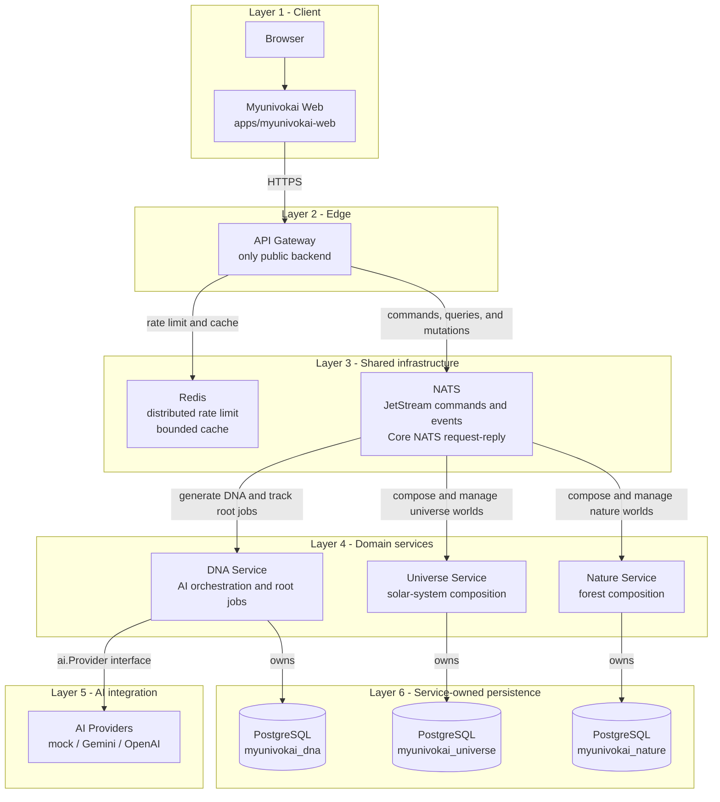

# Myunivokai

Myunivokai is an AI-powered personal 3D universe generator. A visitor describes
themselves once; the platform creates canonical ProfileDNA and composes either
a Universe or a Nature world without exposing AI, databases, NATS, Redis, or
domain services to the browser.

## Architecture



The diagram is an ownership and communication tree, not a request sequence.
Domain services both consume and publish messages through NATS. Redis is edge
state owned by the gateway; it is not a job queue. Each service is the sole
owner of its PostgreSQL database.

- `services/api-gateway`: the only public backend; validates input, returns
  `202 + jobId`, polls jobs through NATS, and owns Redis edge policy.
- `services/dna-service`: raw profile input, root generation jobs, AI provider
  abstraction, immutable ProfileDNA versions, inbox/outbox.
- `services/universe-service`: deterministic solar-system worlds and variants.
- `services/nature-service`: deterministic forest worlds and variants.
- `contracts`: public OpenAPI, JSON Schemas, NATS fixtures, and shared Go types.
- `infra`: shared local PostgreSQL, JetStream NATS, Redis, ACL, and bootstrap.

Universe and Nature intentionally keep the `-service` suffix and are deployed
as Render Background Workers named `myunivokai-universe` and
`myunivokai-nature`; `worker` is their runtime type, not part of their names.

There is no auth service in V1. Browsers cannot call domain services because
those processes expose no HTTP server or host port. NATS credentials and
subject ACLs enforce internal boundaries.

## Run locally

Requirements: Docker Desktop with Compose 2.20+.

```powershell
docker compose -f docker-compose-local.yml config
docker compose -f docker-compose-local.yml up --build
```

Public endpoints:

| Component | URL |
| --- | --- |
| Web | <http://localhost:3000> |
| Gateway | <http://localhost:8080> |
| Liveness | <http://localhost:8080/api/v1/healthz> |
| Readiness | <http://localhost:8080/api/v1/readyz> |
| PostgreSQL diagnostics | `localhost:15432` |
| NATS client diagnostics | `nats://localhost:14222` |
| NATS monitor | <http://localhost:18222> |
| Redis diagnostics | `localhost:16379` |

The tracked `.env.local` values are local-only credentials. Never replace them
with managed or production secrets.

Shared infrastructure can be started separately, followed by one component:

```powershell
docker compose --env-file infra/.env.local -f infra/docker-compose-local.yml up -d
docker compose --env-file services/universe-service/.env.local `
  -f services/universe-service/docker-compose-local.yml up --build
```

Component Compose files share the named backend network and expect `infra` to
already be running when used outside the root aggregator. Their `.env.local`
files are also attached directly to their runtime containers; `--env-file`
remains useful for standalone Compose interpolation and explicit overrides.

## Quality gates

```powershell
cd contracts/go; go test ./...
cd ../../services/api-gateway; go test ./...; go vet ./...; go build ./...
cd ../dna-service; go test ./...; go vet ./...; go build ./...
cd ../universe-service; go test ./...; go vet ./...; go build ./...
cd ../nature-service; go test ./...; go vet ./...; go build ./...
cd ../../apps/myunivokai-web; npm run typecheck; npm run lint; npm test; npm run build
npm audit --omit=dev --audit-level=high
```

## Contracts and operations

- Current architecture: [Vision V1](notes/vision/versions/v1-2026-07-22/README.md)
- Sprint 1 migration: [Sprint 01](notes/sprints/sprint-01-2026-07-22/README.md)
- Local environment: [local-environment.md](notes/sprints/sprint-01-2026-07-22/local-environment.md)
- Render runbook: [deployment-guide.md](notes/sprints/sprint-01-2026-07-22/deployment-guide.md)
- API contract: [contracts/openapi.yaml](contracts/openapi.yaml)
- Internal docs index: [notes/README.md](notes/README.md)

Production provisioning and deployment require operator-supplied managed NATS,
Redis, Neon, and Render credentials. `render.yaml` defines the fleet but does
not create or delete managed databases. Production promotion is currently
blocked by Sprint story
[S1-SECURITY-001](notes/sprints/sprint-01-2026-07-22/user-stories.md#s1-security-001--remove-vulnerable-frontend-runtime-dependencies):
the existing Next.js 14 runtime must be upgraded and browser-regression tested
before deployment.
