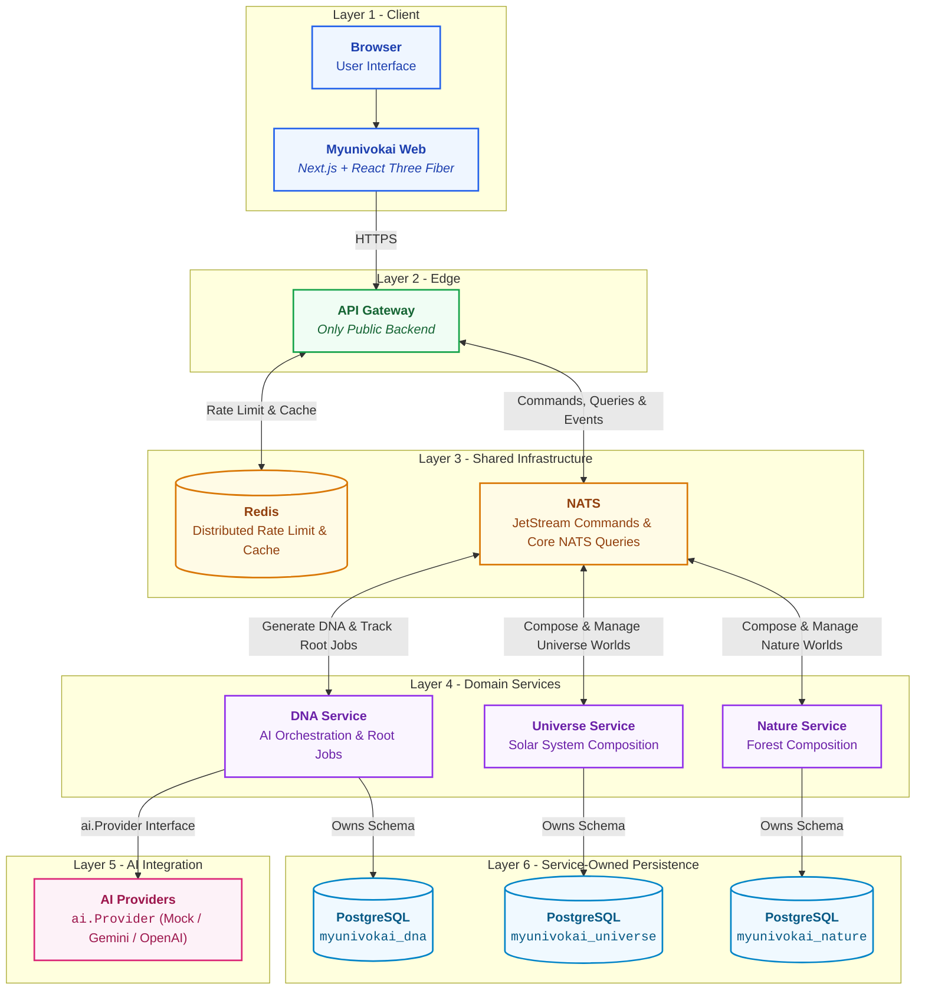

# Myunivokai

AI-powered personal 3D universe generator.

A visitor describes themselves once.
The platform creates a canonical ProfileDNA from that input.
Then it composes a **Universe** (Solar System) or a **Nature** (Forest) world
and renders it as an interactive 3D scene right in the browser.

---

## Architecture



The diagram shows ownership and communication flow, not request sequence.
Each service owns its own PostgreSQL database.
Redis belongs to the gateway — it handles caching and rate limits, not job queuing.

| Service | What it does |
| --- | --- |
| `services/api-gateway` | The only public-facing backend. Validates input, publishes commands to NATS, returns `202 + jobId`, and manages Redis caching. |
| `services/dna-service` | Handles AI orchestration, root generation jobs, ProfileDNA versioning, and the transactional outbox. |
| `services/universe-service` | Computes deterministic solar-system worlds and variants from a seed. No AI calls. |
| `services/nature-service` | Computes deterministic forest worlds and variants from a seed. No AI calls. |
| `contracts` | Shared OpenAPI spec, JSON Schemas, NATS subject names, and Go types used across services. |
| `infra` | Local development infrastructure: PostgreSQL, NATS JetStream, Redis, ACL config, and bootstrap scripts. |

---

## How it works

1. User fills a form in the Next.js frontend.
2. Frontend sends a `POST` request to the API Gateway.
3. Gateway validates input, applies rate limits via Redis,
   publishes a durable command to NATS JetStream,
   and immediately returns **202 Accepted** with a `jobId`.
4. DNA Service picks up the command, calls the configured AI provider
   to generate a canonical ProfileDNA, stores the root job in its database,
   and emits a compose command for the appropriate family service.
5. Universe Service or Nature Service picks up the compose command,
   computes a deterministic World Seed and World Scene Config (no AI involved),
   stores the world and its first variant, and emits a completion event.
6. DNA Service listens for the completion event and marks the root job as done.
7. Frontend polls `GET /api/jobs/{jobId}` until the job completes,
   then fetches the world data and renders the 3D scene with React Three Fiber.

---

## Key design decisions

### AI only generates the semantic profile — all 3D numbers are deterministic

The AI provider produces conceptual traits like archetype, narrative, mood, energy, and palette intent.

Every numeric value that goes into 3D rendering — orbit radii, planet sizes,
forest density, lighting angles — is derived from a seed using safe mathematical bounds.

What this means in practice:
- Generating alternative variants (`POST /worlds/{id}/variants`) costs **zero AI calls**.
- The same seed always produces the exact same 3D scene.

### Single public edge with interchangeable AI providers

The browser only talks to the API Gateway.
Domain services, databases, NATS, and Redis are all private.

All domain services run as NATS background workers: `myunivokai-dna`, `myunivokai-universe`, `myunivokai-nature`.

AI providers (`Gemini`, `OpenAI`, `mock`) sit behind a single `ai.Provider` interface.
Switching providers is just an environment variable change.
The `mock` provider lets you develop and test without any API key.

---

## Core concepts

| Concept | What it means |
| --- | --- |
| **ProfileDNA** | The AI-generated semantic profile: archetype, narrative, traits, energy, facets, palette intent, atmosphere. This is the only thing AI produces. |
| **World Seed** | A deterministic seed computed by the backend. Same seed = same 3D scene. No randomness in rendering code. |
| **World Scene Config** | The full numeric recipe for a 3D scene (planets, orbits, lighting, palette, mood). Computed from the seed, completely AI-free. |
| **Variant** | An alternative scene config for the same world. Generated from a new seed at zero AI cost. One variant is marked as the selected one. |
| **Mood Scene Profiles** | Per-mood rendering parameters, mirrored in both Go and TypeScript to keep visuals consistent. |
| **Share Slug** | Publishing a world creates a public, privacy-safe read-only URL at `/share/worlds/{slug}`. |
| **Async Job & Polling** | Gateway returns `202 + jobId`. Frontend polls `GET /api/jobs/{jobId}` until the result is ready. |

---

## Tech stack

### Backend

| Technology | Role |
| --- | --- |
| **Go** | All backend services |
| **chi** | HTTP router (API Gateway) |
| **pgxpool** | PostgreSQL connection pooling (DNA, Universe, Nature) |
| **NATS JetStream** | Durable command/event messaging between services |
| **Core NATS** | Lightweight request-reply queries |
| **Redis** | Distributed rate limiting and response caching (Gateway) |
| **zerolog** | Structured JSON logging |

### Frontend

| Technology | Role |
| --- | --- |
| **Next.js 14** | App Router, SSR, API route proxies |
| **React 18 + TypeScript** | UI components and type safety |
| **React Three Fiber** | three.js integration for 3D rendering |
| **@react-three/drei** | three.js helpers and abstractions |
| **@react-three/postprocessing** | Post-processing effects (bloom, vignette) |
| **Tailwind CSS** | Styling with custom design tokens (Vitrine + Liquid Glass) |
| **vitest** | Unit testing |

### Infrastructure

| Technology | Role |
| --- | --- |
| **PostgreSQL 17** | 3 isolated databases, one per domain service |
| **Neon** | Managed PostgreSQL hosting (production) |
| **NATS 2.11** | Managed messaging (production) |
| **Redis 7.4** | Managed cache (production) |
| **Docker Compose** | Local full-stack development |
| **Render** | Production hosting (web services + background workers) |
| **GitHub Actions** | CI quality gates on every PR |

---

## Prerequisites

- **Docker Desktop** with Compose v2.20+ (required for local development).
- **Go 1.23+** — only needed if running backend services outside Docker.
- **Node.js 20+** with npm — only needed if running frontend outside Docker.

---

## Run locally — full stack (recommended)

This starts everything in Docker: databases, messaging, all backend services, and the frontend.

**Step 1.** Copy the environment template (skip if `.env.local` already exists):

```powershell
cp .env.example .env.local
```

> The repo ships a working `.env.local` with safe local-only credentials.

**Step 2.** Start all services:

```powershell
docker compose -f docker-compose-local.yaml up --build
```

Or use the Makefile shortcut:

```powershell
make local-up
```

**Step 3.** Wait for all containers to report healthy, then open:

| Component | URL |
| --- | --- |
| Web (frontend) | http://localhost:3000 |
| API Gateway | http://localhost:8080 |
| Liveness probe | http://localhost:8080/api/v1/healthz |
| Readiness probe | http://localhost:8080/api/v1/readyz |

**Step 4.** Stop everything:

```powershell
make local-down
```

### Diagnostics

These ports are available for debugging when the stack is running:

| Service | Address |
| --- | --- |
| PostgreSQL | `localhost:15432` |
| NATS client | `nats://localhost:14222` |
| NATS monitor | http://localhost:18222 |
| Redis | `localhost:16379` |

---

## Run locally — single service

When you want to iterate on one service with hot-reload while infrastructure runs in Docker.

**Step 1.** Start shared infrastructure only:

```powershell
docker compose --env-file infra/.env.local -f infra/docker-compose-local.yaml up -d
```

**Step 2.** Start the service you're working on (example: universe-service):

```powershell
docker compose --env-file services/universe-service/.env.local `
  -f services/universe-service/docker-compose-local.yaml up --build
```

Each service's compose file joins the shared `myunivokai-local-backend` network
and expects infrastructure to already be running.

---

## Environment files

The project uses `.env.local` files for actual credentials (tracked in git as local-only values)
and `.env.example` files as templates with placeholder values.

> **Never** put managed or production secrets in `.env.local`.

### Which file is used where

| Environment file | Loaded by | What it configures |
| --- | --- | --- |
| `.env.local` (root) | Root `docker-compose-local.yaml` | Everything. Master config for all services + infra in full-stack mode. |
| `infra/.env.local` | `infra/docker-compose-local.yaml` | PostgreSQL, NATS, and Redis only. Used when running infra standalone. |
| `services/api-gateway/.env.local` | `services/api-gateway/docker-compose-local.yaml` | NATS connection, Redis, rate limits, cache TTLs. |
| `services/dna-service/.env.local` | `services/dna-service/docker-compose-local.yaml` | Database, NATS, AI provider config, API keys. |
| `services/universe-service/.env.local` | `services/universe-service/docker-compose-local.yaml` | Database, NATS, outbox settings. |
| `services/nature-service/.env.local` | `services/nature-service/docker-compose-local.yaml` | Database, NATS, outbox settings. |
| `apps/myunivokai-web/.env.local` | Web compose file and `npm run dev` | Just `NEXT_PUBLIC_GATEWAY_BASE_URL`. |

### How full-stack mode wires everything together

The root `docker-compose-local.yaml` is a Compose `include:` aggregator.
It passes the root `.env.local` to every child compose file:

```yaml
include:
  - path: ./infra/docker-compose-local.yaml
    env_file: ./.env.local
  - path: ./services/api-gateway/docker-compose-local.yaml
    env_file: ./.env.local
  # ... same pattern for dna-service, universe-service, nature-service, web
```

Each child compose file also loads its own `.env.local` via `env_file:`,
but root-level variables take priority through Compose interpolation.

### Why NATS credentials have prefixes in the root file

The root `.env.local` needs to hold credentials for every service in one file.
To avoid naming collisions, it uses prefixed names like `NATS_GATEWAY_USERNAME`.

Each service's compose file maps these to the unprefixed names its Go binary expects:

```yaml
# In services/api-gateway/docker-compose-local.yaml:
environment:
  NATS_USERNAME: ${NATS_GATEWAY_USERNAME:-myunivokai_gateway}
  NATS_PASSWORD: ${NATS_GATEWAY_PASSWORD:-myunivokai_local_gateway}
```

### Production

In production (Render), environment variables are set through the dashboard.
The `render.yaml` blueprint lists which variables each service needs.
Secrets like database URLs, NATS URLs, and API keys are configured manually per service.

---

## Repository layout

```txt
.
├── AGENTS.md                         # Agent instructions and stack rules
├── Makefile                          # Build and test shortcuts
├── render.yaml                       # Render deployment blueprint
├── docker-compose-local.yaml         # Root aggregator for local full-stack development
├── .env.example                      # Full-stack environment template
├── apps/
│   └── myunivokai-web/               # Next.js 14 + React Three Fiber frontend
│       ├── .env.example              # Template: NEXT_PUBLIC_GATEWAY_BASE_URL
│       ├── Dockerfile.prod           # Production container
│       ├── public/                   # Static 3D assets (GLB models)
│       └── src/
│           ├── app/                  # App Router pages and API route proxies
│           ├── components/           # Shared UI components (Vitrine + Liquid Glass)
│           ├── features/             # Feature modules and scene renderers
│           │   └── scene-renderers/  # SceneType registry (solar-system/, forest/, fallback/)
│           └── lib/                  # API clients, polling hooks, state utilities
├── services/
│   ├── api-gateway/                  # Public HTTP edge service
│   │   ├── .env.example              # Template: NATS, Redis, rate limits, cache TTLs
│   │   ├── Dockerfile.prod
│   │   ├── cmd/gateway/              # Entry point
│   │   └── internal/                 # Routes, NATS broker, Redis rate limiter
│   ├── dna-service/                  # AI orchestration background worker
│   │   ├── .env.example              # Template: Database, NATS, AI provider, API keys
│   │   ├── Dockerfile.prod
│   │   └── internal/                 # AI providers, database, validation
│   ├── universe-service/             # Solar-system world generator worker
│   │   ├── .env.example              # Template: Database, NATS, outbox
│   │   ├── Dockerfile.prod
│   │   └── internal/                 # Seed/PRNG math, models, database
│   └── nature-service/               # Forest world generator worker
│       ├── .env.example              # Template: Database, NATS, outbox
│       ├── Dockerfile.prod
│       └── internal/                 # Seed/PRNG math, models, database
├── contracts/                        # Cross-service API and messaging contracts
│   ├── go/                           # Shared Go types and NATS subject names
│   ├── openapi.yaml                  # REST API specification
│   ├── scenes/                       # Scene configuration samples
│   └── schemas/                      # JSON Schemas for ProfileDNA
├── infra/                            # Local development infrastructure
│   ├── .env.example                  # Template: PostgreSQL, NATS, Redis credentials
│   ├── docker-compose-local.yaml     # PostgreSQL, NATS JetStream, Redis containers
│   ├── nats/                         # NATS server config and JetStream bootstrap
│   ├── postgres/                     # Init scripts and multi-database setup
│   └── redis/                        # Redis configuration
└── notes/                            # Engineering documentation
    ├── README.md                     # Documentation index
    ├── be/ & fe/                     # Backend and frontend architecture overviews
    ├── coding/                       # Git conventions and coding style rules
    └── vision/ & sprints/            # Architecture specs and sprint plans
```

The layout is designed for growth.
New services like `services/city-service` or new clients like `apps/mobile-app`
can be added without touching existing messaging contracts or database boundaries.

---

## Quality gates

```powershell
# Backend — contracts
cd contracts/go; go test ./...

# Backend — api-gateway
cd ../../services/api-gateway; go test ./...; go vet ./...; go build ./...

# Backend — dna-service
cd ../dna-service; go test ./...; go vet ./...; go build ./...

# Backend — universe-service
cd ../universe-service; go test ./...; go vet ./...; go build ./...

# Backend — nature-service
cd ../nature-service; go test ./...; go vet ./...; go build ./...

# Frontend
cd ../../apps/myunivokai-web; npm run typecheck; npm run lint; npm test; npm run build
npm audit --omit=dev --audit-level=high
```

---

## Documentation

Internal engineering docs live in the `notes/` folder.
See [notes/README.md](notes/README.md) for the full index.

Key docs:
- [coding/git-convention.md](notes/coding/git-convention.md) — branch naming and commit format
- [coding/coding-style.md](notes/coding/coding-style.md) — code style rules
- [be/source-overview.md](notes/be/source-overview.md) — backend architecture
- [fe/source-overview.md](notes/fe/source-overview.md) — frontend architecture
- [contracts/openapi.yaml](contracts/openapi.yaml) — API specification
