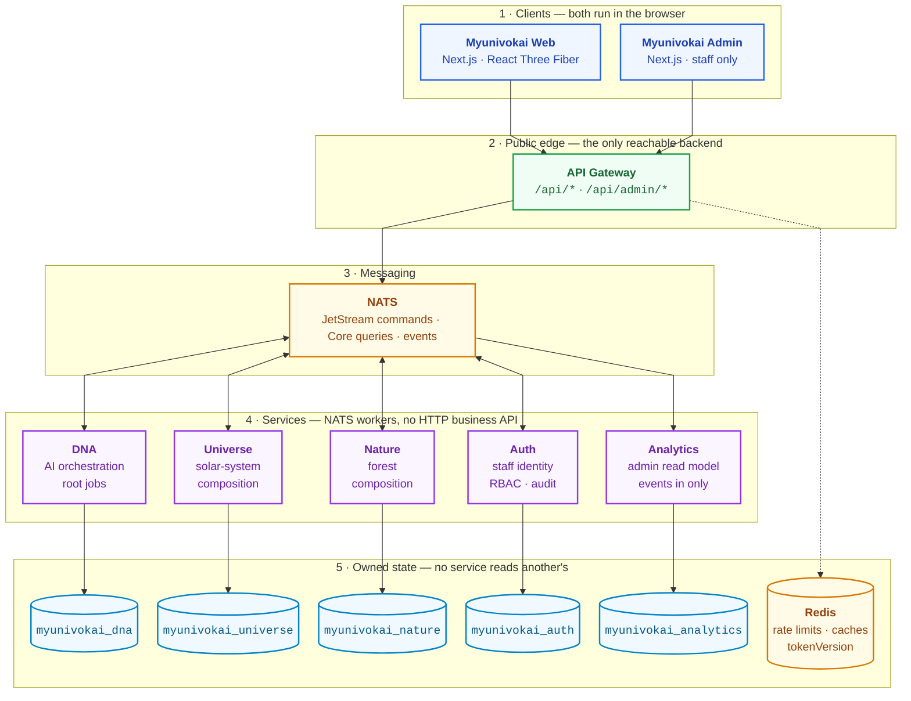
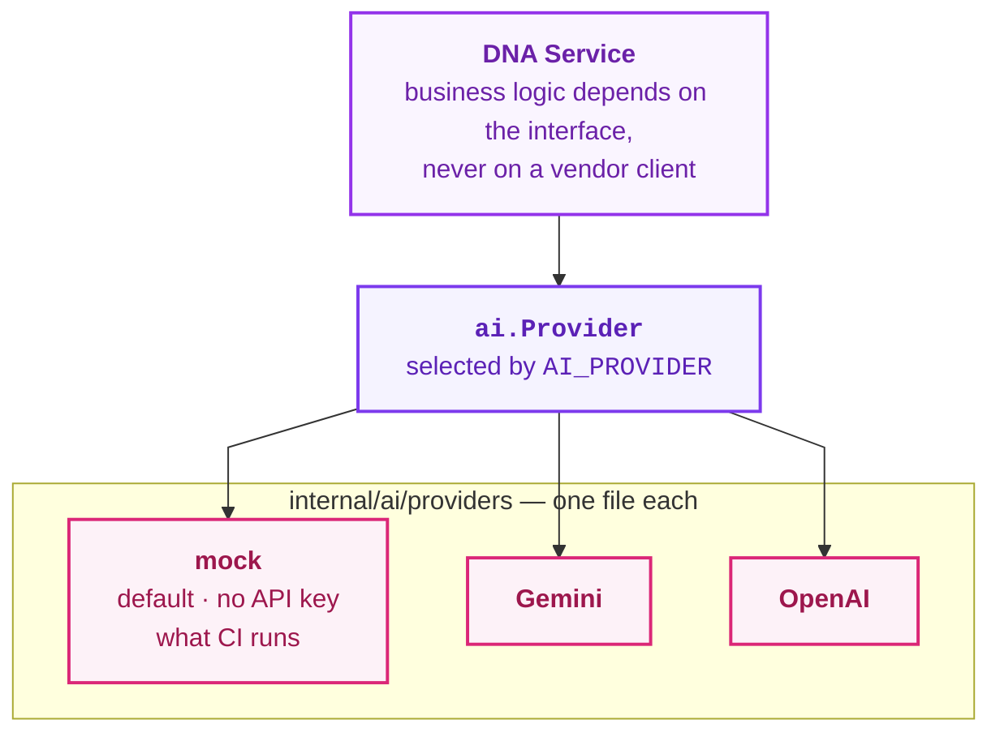

# Myunivokai

AI-powered personal 3D universe generator.

A visitor describes themselves once.
The platform creates a canonical ProfileDNA from that input.
Then it composes a **Universe** (Solar System) or a **Nature** (Forest) world
and renders it as an interactive 3D scene right in the browser.

---

## Architecture

Read it top to bottom. Every service sits directly above the one database it
owns, and each band is one layer of the stack.



- The diagram shows **ownership, not request sequence** — the generation flow
  is the next section.
- Only the gateway is public. NATS, Redis and every service below them are
  private.
- Each service owns exactly one PostgreSQL database and nothing reads
  another's tables — which is why layers 4 and 5 line up one-to-one.
- **Analytics has the only single-headed arrow.** Every other service both
  receives and publishes; analytics consumes events and answers queries but
  publishes no domain subject, so an admin page waits on gateway + auth +
  analytics and never on a domain service the free tier may have put to sleep.
- **Redis sits beside the databases because that is what it is** — the
  gateway's own store, not a step in the request path, which is why its edge is
  dotted. It holds rate-limit counters, safe caches and `tokenVersion`, never
  durable jobs or domain records. `auth-service` also writes `tokenVersion`
  there, so a disabled account's still-valid access token is rejected without a
  round trip on every request; that edge is left out of the drawing because one
  back-arrow across four layers costs more legibility than it buys.
- AI providers are deliberately absent here: they are not owned persistence.
  See [interchangeable AI providers](#single-public-edge-with-interchangeable-ai-providers).

| Service | What it does |
| --- | --- |
| `services/api-gateway` | The only public-facing backend. Validates input, publishes commands to NATS, returns `202 + jobId`, and manages Redis caching. |
| `services/dna-service` | Handles AI orchestration, root generation jobs, ProfileDNA versioning, and the transactional outbox. |
| `services/universe-service` | Computes deterministic solar-system worlds and variants from a seed. No AI calls. |
| `services/nature-service` | Computes deterministic forest worlds and variants from a seed. No AI calls. |
| `services/auth-service` | Staff identity: login, refresh, roles, permissions, audit. Core NATS request-reply only. |
| `services/analytics-service` | The admin read model. Consumes events, writes its own database, answers admin queries — it publishes nothing and calls no other service, so an admin page waits only on the gateway, auth and analytics. |
| `contracts` | Shared OpenAPI spec, JSON Schemas, NATS subject names, and Go types used across services. |
| `infra` | Local development infrastructure: PostgreSQL, NATS JetStream, Redis, ACL config, and bootstrap scripts. |

---

## Generation flow

- `POST /api/{family}/worlds` — gateway validates, rate-limits, publishes to JetStream.
- Gateway answers **202 Accepted** with a `jobId`; it never waits for the world.
- `dna-service` consumes the command and calls the AI provider for a ProfileDNA.
- `dna-service` stores the root job, then emits a compose command for the family.
- `universe-service` or `nature-service` composes the world from a seed — no AI.
- The family service stores the world plus variant 1 and emits a completion event.
- `dna-service` consumes that event and marks the root job done.
- Frontend polls `GET /api/jobs/{jobId}`, then loads the world and renders it.

`{family}` is `universe` or `nature`. Both families use identical request shapes.

## World lifecycle after generation

- `GET /api/{family}/worlds/{id}` — the private dashboard read, cached in Redis.
- `POST /api/{family}/worlds/{id}/variants` — new seed, new scene, zero AI cost.
- `POST /api/{family}/worlds/{id}/variants/{variantId}/select` — pick what is shown.
- `POST /api/{family}/worlds/{id}/publish` — mint the share slug once, then reuse it.
- `GET /api/{family}/share/worlds/{slug}` — public, privacy-safe, cached in Redis.
- Frontend share pages live at `/universe/share/worlds/{slug}` and `/nature/share/worlds/{slug}`.

## Gateway caching and invalidation

- Three Redis namespaces: `job:v1`, `world:v1`, `share:v1`.
- `world:v1` is keyed by world id; `share:v1` is keyed by share slug.
- Every mutation deletes `world:v1` before and after the call.
- A mutation cannot derive the slug from a world id, so the domain service
  returns `shareSlug` in its response and the gateway deletes `share:v1` with it.
- Without that, selecting a variant left the share page serving the previous
  scene for a whole TTL — which looked like the share losing scene features.

## Admin read path

- Every world mutation above also bumps `worlds.revision` and writes a
  `world.changed` snapshot to the outbox **inside the same transaction**.
- `analytics-service` consumes those events into its own database:
  `world_projections` and `job_projections`, guarded by an inbox table and an
  upsert that only ever moves a world's `revision` forward.
- `/api/admin/{overview,timeseries,worlds,jobs}` reads from that model alone.
  No admin route ever publishes a `universe`, `nature` or `dna` subject, and a
  gateway test asserts it.
- The read model is **eventually consistent**: a new world appears in the admin
  app seconds after it is created. That is the accepted trade for an admin page
  that waits on two processes instead of four.
- The cost to keep paying: a future mutation that forgets its event drifts the
  read model silently. `world_snapshot_test.go` in both family services asserts
  every mutating store method leaves an event behind.

---

## Waking a sleeping service

Every service except the gateway is a pure NATS consumer, so on a scale-to-zero
plan nothing ever sends it the inbound HTTP it needs to wake up. A query
against a sleeping service comes back as `no-responders` **immediately** — not
as a timeout — and the gateway used to report that as the same
`503 SERVICE_UNAVAILABLE` it reports for a genuinely broken broker.

- `503 SERVICE_WAKING` + `Retry-After` — nobody was subscribed. The gateway has
  started the service and the request never reached it, so any method is safe
  to retry. Both frontends wait it out.
- `503 SERVICE_UNAVAILABLE` — a real fault; retrying will not help.
- `504 SERVICE_TIMEOUT` — awake, just slow.

Reads wake reactively. `POST /api/{family}/worlds` cannot: a JetStream publish
succeeds with no consumer alive, so that path returns `202` and stalls at
`queued` with no error anywhere — it wakes dna and the family service *before*
publishing instead.

One call per sleeping service per lock window, triggered by a real request,
never on a schedule. A keep-alive cron is exactly what the free tier's
account-wide hour budget rules out. `SERVICE_WAKE_PLATFORM=none` is the default
and the correct value on any always-on host, so leaving free tier is one line
of config — see
[notes/vision/service-wake-mechanism.md](notes/vision/service-wake-mechanism.md).

---

## Key design decisions

### AI only generates the semantic profile — all 3D numbers are deterministic

- The AI produces concepts: archetype, narrative, mood, energy, palette intent.
- Every rendering number comes from the seed inside safe mathematical bounds.
- That covers orbit radii, planet sizes, forest density and lighting angles.
- Alternative variants therefore cost **zero AI calls**.
- The same seed always produces the same scene, on any page, forever.
- `Math.random()` is banned in scene code; the frontend mirrors the seeded PRNG.

### Every world plays music, and the same DNA arranges it

- The notes are **real compositions in the public domain**, shipped as note data.
- Six pieces — Satie, Bach, Debussy — 84 kB for all six; a world fetches one.
- The sound comes from CC0 recorded instruments: 39 samples, 1.27 MB total.
- The DNA chooses the piece, the instruments, the tempo, the key and how full
  the chords are; the seed chooses the opening phrase, the room and the timing.
- `Math.random()` is banned here exactly as in scene code — same seed, same
  performance, on every page and every reload.
- Famous modern songs are not an option however freely their sheet music
  circulates: a composition is copyrighted for 70 years after the composer's
  death, and playing it with our own samples is what a sync licence covers.
- Audio never reaches for a provider, so swapping to a live AI changes nothing
  on this path. See [notes/fe/ambient-audio-mechanism.md](notes/fe/ambient-audio-mechanism.md).

### Single public edge with interchangeable AI providers

- The browser talks to the gateway and nothing else.
- `Gemini`, `OpenAI` and `mock` sit behind one `ai.Provider` interface.
- Switching provider is an environment variable, not a code change.
- `mock` runs the whole flow with no API key, and is what tests use.
- `dna-service` is the only service that holds a provider key at all.



`internal/wake` in the gateway is built to the same shape on purpose:
`wake.Platform` is the interface, `wake/platforms/` holds the adapters,
`wake.Coordinator` holds the policy they share, and `SERVICE_WAKE_PLATFORM`
is the switch — the exact roles `ai.Provider`, `ai.Orchestrator` and
`AI_PROVIDER` play here.

---

## Core concepts

| Concept | What it means |
| --- | --- |
| **ProfileDNA** | The AI-generated semantic profile: archetype, narrative, traits, energy, facets, palette intent, atmosphere. This is the only thing AI produces. |
| **World Seed** | A deterministic seed computed by the backend. Same seed = same 3D scene. No randomness in rendering code. |
| **World Scene Config** | The full numeric recipe for a 3D scene (planets, orbits, lighting, palette, mood). Computed from the seed, completely AI-free. |
| **Variant** | An alternative scene config for the same world. Generated from a new seed at zero AI cost. One variant is marked as the selected one. |
| **Mood Scene Profiles** | Per-mood rendering parameters, mirrored in both Go and TypeScript to keep visuals consistent. |
| **Share Slug** | Publishing mints one permanent slug per world. Republishing reuses it. |
| **Ambient Soundscape** | The music a world plays: a public-domain score performed by recorded instrument samples, with the piece, the instruments, the tempo, the key and the chord density all resolved from the DNA and the seed. |
| **Rare Features** | Black hole, binary suns, meteor shower. Rolled on the frontend from the seed, never stored, so the same seed must reach every page. |
| **Async Job & Polling** | Gateway returns `202 + jobId`. Frontend polls `GET /api/jobs/{jobId}` until the result is ready. |

---

## Tech stack

### Backend

| Technology | Role |
| --- | --- |
| **Go** | All backend services |
| **chi** | HTTP router (API Gateway) |
| **pgxpool** | PostgreSQL connection pooling (DNA, Universe, Nature) |
| **NATS JetStream** | Durable command/event messaging between services |
| **Core NATS** | Lightweight request-reply queries |
| **Redis** | Distributed rate limiting and response caching (Gateway) |
| **zerolog** | Structured JSON logging |

### Frontend

| Technology | Role |
| --- | --- |
| **Next.js 14** | App Router, SSR, API route proxies |
| **React 18 + TypeScript** | UI components and type safety |
| **React Three Fiber** | three.js integration for 3D rendering |
| **@react-three/drei** | three.js helpers and abstractions |
| **@react-three/postprocessing** | Post-processing effects (bloom, vignette) |
| **Web Audio API** | Ambient music: sampled instruments, convolution reverb, lookahead scheduling |
| **Tailwind CSS** | Styling with custom design tokens (Vitrine + Liquid Glass) |
| **vitest** | Unit testing |

### Infrastructure

| Technology | Role |
| --- | --- |
| **PostgreSQL 17** | 3 isolated databases, one per domain service |
| **Neon** | Managed PostgreSQL hosting (production) |
| **NATS 2.11** | Managed messaging (production) |
| **Redis 7.4** | Managed cache (production) |
| **Docker Compose** | Local full-stack development |
| **Render** | Production hosting (web services + background workers) |
| **GitHub Actions** | CI quality gates on every PR |

---

## Prerequisites

- **Docker Desktop** with Compose v2.20+ (required for local development).
- **Go 1.23+** — only needed if running backend services outside Docker.
- **Node.js 20+** with npm — only needed if running frontend outside Docker.

---

## Run locally — full stack

Everything in Docker: databases, messaging, all backend services, the frontend.

**Step 1.** Copy the environment template (skip if `.env.local` already exists):

```powershell
cp .env.example .env.local
```

- The repo ships a working `.env.local` with local-only credentials.

**Step 2.** Start all services:

```powershell
docker compose --env-file .env.local -f docker-compose-local.yaml up --build
```

- `--env-file .env.local` is **required**, not cosmetic.
- Compose auto-loads a root `.env` when the flag is absent.
- A root `.env` outranks the `env_file:` entries under `include:`.
- Anyone holding a deploy-shaped `.env` then boots the local stack against
  production NATS, production Redis and the live AI provider — silently.
- Verify what you are about to start: `docker compose --env-file .env.local -f docker-compose-local.yaml config`.
- `make local-up` passes the flag for you.

**Step 3.** Wait for the containers to report healthy, then open:

| Component | URL |
| --- | --- |
| Web (frontend) | http://localhost:41300 |
| Admin (staff console) | http://localhost:41900 |
| API Gateway | http://localhost:41800 |
| Liveness probe | http://localhost:41800/api/v1/healthz |
| Readiness probe | http://localhost:41800/api/v1/readyz |

**Step 4.** Create the first staff account — nothing can log into the admin
console until one exists, and there is no self-signup anywhere in the system:

```powershell
docker compose --env-file .env.local -f docker-compose-local.yaml exec auth-service go run ./cmd/bootstrap --email admin@myunivokai.local --password "ChangeMe12345Local"
```

- Creates one **super admin** account directly in `myunivokai_auth` — every
  permission, always (see `services/auth-service/README.md`).
- Safe to run again later with a different `--email` to create additional
  accounts; it does not touch or reset any existing account.
- Log in at http://localhost:41900/login with `admin@myunivokai.local` / `ChangeMe12345Local` (or whatever you passed above).

**Step 5.** Stop everything:

```powershell
make local-down
```

### Published ports

- Deliberately off the usual numbers so the stack never fights another project.
- Nothing here uses `3000`, `8080`, `5432`, `6379` or `4222` on the host.
- Change any of them in `.env.local`; the compose files read the variables.

| Host port | Service | Container port |
| ---: | --- | ---: |
| 41300 | Web (frontend) | 41300 |
| 41900 | Admin (staff console) | 41900 |
| 41800 | API Gateway | 41800 |
| 15432 | PostgreSQL | 5432 |
| 14222 | NATS client | 4222 |
| 18222 | NATS monitoring | 8222 |
| 16379 | Redis | 6379 |

- Domain services publish no host port at all — they are NATS workers.
- Production ports come from the platform's `PORT`, untouched by these values.

---

## Run locally — single service

For iterating on one service while infrastructure runs in Docker.

**Step 1.** Start shared infrastructure only:

```powershell
docker compose --env-file infra/.env.local -f infra/docker-compose-local.yaml up -d
```

**Step 2.** Start the service you are working on (example: universe-service):

```powershell
docker compose --env-file services/universe-service/.env.local `
  -f services/universe-service/docker-compose-local.yaml up --build
```

- Each service compose file joins the shared `myunivokai-local-backend` network.
- Each expects infrastructure to be running already.
- The frontend outside Docker: `cd apps/myunivokai-web; npm run dev` (port 41300).

---

## Environment files

- `.env.local` holds real local-only values and is tracked in git.
- `.env.example` is the template with placeholders.
- A root `.env` is gitignored and belongs to whoever deploys — never to the stack.
- **Never** put managed or production secrets in `.env.local`.

### Which file is used where

| Environment file | Loaded by | What it configures |
| --- | --- | --- |
| `.env.local` (root) | Root `docker-compose-local.yaml` | Everything. Master config for all services + infra in full-stack mode. |
| `infra/.env.local` | `infra/docker-compose-local.yaml` | PostgreSQL, NATS, and Redis only. Used when running infra standalone. |
| `services/api-gateway/.env.local` | `services/api-gateway/docker-compose-local.yaml` | NATS connection, Redis, rate limits, cache TTLs. |
| `services/dna-service/.env.local` | `services/dna-service/docker-compose-local.yaml` | Database, NATS, AI provider config, API keys. |
| `services/universe-service/.env.local` | `services/universe-service/docker-compose-local.yaml` | Database, NATS, outbox settings. |
| `services/nature-service/.env.local` | `services/nature-service/docker-compose-local.yaml` | Database, NATS, outbox settings. |
| `services/auth-service/.env.local` | `services/auth-service/docker-compose-local.yaml` | Database, NATS, Redis, token and Argon2id settings. |
| `services/analytics-service/.env.local` | `services/analytics-service/docker-compose-local.yaml` | Database, NATS, event-consumer settings. No credentials — it verifies no token and calls no provider. |
| `apps/myunivokai-web/.env.local` | Web compose file and `npm run dev` | Just `NEXT_PUBLIC_GATEWAY_BASE_URL`. |

### How full-stack mode resolves variables

- The root `docker-compose-local.yaml` is an `include:` aggregator, nothing more.
- Each `include:` entry names the root `.env.local` for interpolation.
- Each child compose file also loads its own `.env.local` via `env_file:`.
- Root-level variables win over child ones through Compose interpolation.
- A root `.env` wins over all of it, which is why the `--env-file` flag matters.

### Why NATS credentials are prefixed in the root file

- One root file has to hold credentials for every service at once.
- Prefixed names (`NATS_GATEWAY_USERNAME`) avoid collisions between them.
- Each service compose file maps the prefixed name to the plain one its binary reads.

```yaml
# In services/api-gateway/docker-compose-local.yaml:
environment:
  NATS_USERNAME: ${NATS_GATEWAY_USERNAME:-myunivokai_gateway}
  NATS_PASSWORD: ${NATS_GATEWAY_PASSWORD:-myunivokai_local_gateway}
```

### Production

- Render sets every variable through its dashboard; `render.yaml` lists which.
- Database URLs, NATS URLs and API keys are configured per service, by hand.
- The service port comes from Render's `PORT`, so local port choices never leak.

---

## Repository layout

```txt
.
├── AGENTS.md                         # Agent instructions and stack rules
├── Makefile                          # Build and test shortcuts
├── render.yaml                       # Render deployment blueprint
├── docker-compose-local.yaml         # Root aggregator for local full-stack development
├── .env.example                      # Full-stack environment template
├── apps/
│   ├── myunivokai-web/               # Next.js 14 + React Three Fiber frontend
│   │   ├── .env.example              # Template: NEXT_PUBLIC_GATEWAY_BASE_URL
│   │   ├── Dockerfile.prod           # Production container
│   │   ├── public/                   # Static assets: GLB models, textures, audio samples and scores
│   │   └── src/
│   │       ├── app/                  # App Router pages and API route proxies
│   │       ├── components/           # Shared UI components (Vitrine + Liquid Glass)
│   │       ├── features/             # Feature modules and scene renderers
│   │       │   ├── audio/            # Instrument samples, arrangements, the performing graph
│   │       │   └── scene-renderers/  # SceneType registry (solar-system/, forest/, fallback/)
│   │       └── lib/                  # API clients, polling hooks, state utilities
│   └── myunivokai-admin/             # Next.js staff console; shares no code with the web app
│       ├── .env.example              # Template: ADMIN_GATEWAY_BASE_URL
│       ├── scripts/                  # check-import-boundary.mjs (no myunivokai-web, no three.js)
│       └── src/
│           ├── app/                  # Dashboard routes + the BFF relay to /api/admin
│           ├── components/           # Chrome, shadcn primitives, cursor pagination
│           └── features/             # analytics/, accounts/, roles/, audit/
├── services/
│   ├── api-gateway/                  # Public HTTP edge service
│   │   ├── .env.example              # Template: NATS, Redis, rate limits, cache TTLs
│   │   ├── Dockerfile.prod
│   │   ├── cmd/gateway/              # Entry point
│   │   └── internal/                 # Routes, NATS broker, Redis rate limiter, service wake
│   ├── dna-service/                  # AI orchestration background worker
│   │   ├── .env.example              # Template: Database, NATS, AI provider, API keys
│   │   ├── Dockerfile.prod
│   │   └── internal/                 # AI providers, database, validation
│   ├── universe-service/             # Solar-system world generator worker
│   │   ├── .env.example              # Template: Database, NATS, outbox
│   │   ├── Dockerfile.prod
│   │   └── internal/                 # Seed/PRNG math, models, database
│   ├── nature-service/               # Forest world generator worker
│   │   ├── .env.example              # Template: Database, NATS, outbox
│   │   ├── Dockerfile.prod
│   │   └── internal/                 # Seed/PRNG math, models, database
│   ├── auth-service/                 # Staff identity worker (Core NATS request-reply only)
│   │   ├── .env.example              # Template: Database, NATS, Redis, tokens, Argon2id
│   │   ├── cmd/bootstrap/            # One-off: create the first super-admin
│   │   └── internal/                 # Accounts, roles, permissions, audit, security
│   └── analytics-service/            # Admin read model; consumes events, publishes nothing
│       ├── .env.example              # Template: Database, NATS, event consumer
│       ├── migrations/               # world_projections, job_projections, inbox_messages
│       └── internal/                 # Projection writer, SQL aggregates, keyset pagination
├── contracts/                        # Cross-service API and messaging contracts
│   ├── go/                           # Shared Go types and NATS subject names
│   ├── fixtures/                     # Executable form of each contract; validated in CI
│   ├── openapi.yaml                  # Public REST API specification
│   ├── openapi-admin.yaml            # Staff-only API; deliberately never merged into the public spec
│   ├── scenes/                       # Scene configuration samples
│   └── schemas/                      # JSON Schemas for ProfileDNA
├── infra/                            # Local development infrastructure
│   ├── .env.example                  # Template: PostgreSQL, NATS, Redis credentials
│   ├── docker-compose-local.yaml     # PostgreSQL, NATS JetStream, Redis containers
│   ├── nats/                         # NATS server config and JetStream bootstrap
│   ├── postgres/                     # Init scripts and multi-database setup
│   └── redis/                        # Redis configuration
└── notes/                            # Engineering documentation
    ├── README.md                     # Documentation index
    ├── be/ & fe/                     # Backend and frontend architecture overviews
    ├── coding/                       # Git conventions and coding style rules
    └── vision/ & sprints/            # Architecture specs and sprint plans
```

The layout is designed for growth.
New services like `services/city-service` or new clients like `apps/mobile-app`
can be added without touching existing messaging contracts or database boundaries.
`analytics-service` is the worked example: it was added as a second consumer on
an existing stream, needed no stream or ACL change to receive the new events
(both are already wildcards), and is invisible to `dna-service`, whose consumer
filters on four explicit subjects.

---

## Quality gates

```powershell
# Backend — contracts
cd contracts/go; go test ./...

# Backend — api-gateway
cd ../../services/api-gateway; go test ./...; go vet ./...; go build ./...

# Backend — dna-service
cd ../dna-service; go test ./...; go vet ./...; go build ./...

# Backend — universe-service
cd ../universe-service; go test ./...; go vet ./...; go build ./...

# Backend — nature-service
cd ../nature-service; go test ./...; go vet ./...; go build ./...

# Backend — auth-service
cd ../auth-service; go test ./...; go vet ./...; go build ./...

# Backend — analytics-service
cd ../analytics-service; go test ./...; go vet ./...; go build ./...

# Frontend — product
cd ../../apps/myunivokai-web; npm run typecheck; npm run lint; npm test; npm run build
npm audit --omit=dev --audit-level=high

# Frontend — admin (check:boundary enforces no myunivokai-web and no three.js)
cd ../myunivokai-admin; npm run typecheck; npm run lint; npm run check:boundary; npm test; npm run build
```

---

## Under research — not built, not approved

Four proposals are being argued against the source before any becomes a
sprint. Detail, schemas and the full blocker list are in
[notes/vision/platform-evolution-research.md](notes/vision/platform-evolution-research.md).

| Track | Proposal | State |
| --- | --- | --- |
| A | End-user login, and worlds owned across two databases | Blocked on a decision, not on code: `DEFERRED-AUTH-001` has seven unanswered questions |
| B | Wake counts, request counts and status codes on a dashboard | Ready to start. Must **not** land in `myunivokai_analytics` |
| C | One service written in Rust | Sound if it is track B's service — new, off the product path, and a contract that already exists |
| D | WebGPU instead of WebGL | Unblocked by the Next 16 / React 19 / R3F v9 upgrade that `S1-SECURITY-001` already requires |

Two findings from that research apply to the system as it runs **today**,
independently of whether any track is approved:

- A read model on a scale-to-zero plan wakes only when queried, and
  `MYUNIVOKAI_EVENTS` retains 7 days. Leave the admin console unopened for
  eight and the oldest events expire unconsumed — a permanent projection gap
  with no error anywhere.
- Prometheus cannot be used here. It scrapes on a schedule, which would keep
  all six services permanently awake and defeat the wake mechanism outright.
  Any observability here has to be push-based.

## Documentation

Internal engineering docs live in the `notes/` folder.
See [notes/README.md](notes/README.md) for the full index.

Key docs:
- [coding/git-convention.md](notes/coding/git-convention.md) — branch naming and commit format
- [coding/coding-style.md](notes/coding/coding-style.md) — code style rules
- [be/source-overview.md](notes/be/source-overview.md) — backend architecture
- [fe/source-overview.md](notes/fe/source-overview.md) — frontend architecture
- [vision/analytics-service-plan.md](notes/vision/analytics-service-plan.md) — why the admin app reads from a CQRS read model instead of a gateway fan-out
- [vision/auth-and-admin-plan.md](notes/vision/auth-and-admin-plan.md) — staff identity, RBAC and the admin route group
- [vision/platform-evolution-research.md](notes/vision/platform-evolution-research.md) — end-user ownership across two databases, telemetry, Rust, WebGPU: schemas, blockers and the dependency graph
- [ops/production-deployment-guide.md](notes/ops/production-deployment-guide.md) — step-by-step production deploy runbook
- [fe/ambient-audio-mechanism.md](notes/fe/ambient-audio-mechanism.md) — how the music is made, and how to audition it
- [contracts/openapi.yaml](contracts/openapi.yaml) — API specification
