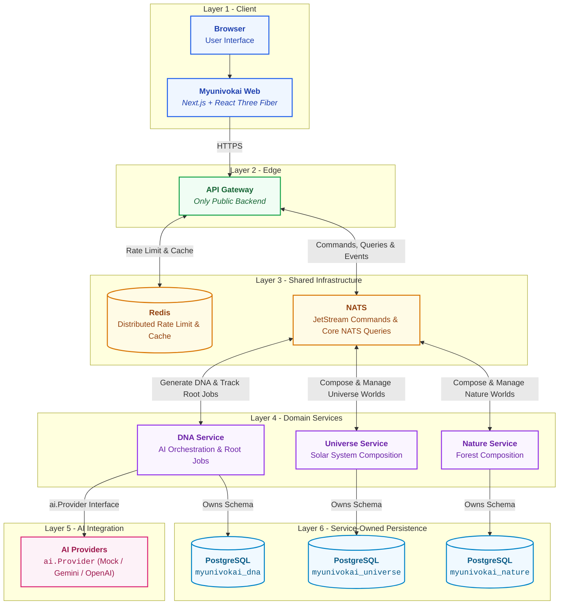

# Myunivokai

Myunivokai is an AI-powered personal 3D universe generator. A visitor describes
themselves once; the platform creates canonical ProfileDNA and composes either
a Universe (Solar System) or a Nature (Forest) world without exposing AI, databases,
NATS, Redis, or domain services directly to the browser.

## Architecture



The diagram is an ownership and communication tree, not a request sequence.
Domain services both consume and publish messages through NATS. Redis is edge
state owned by the gateway; it is not a job queue. Each service is the sole
owner of its PostgreSQL database.

- `services/api-gateway`: the only public backend; validates input, returns
  `202 + jobId`, polls jobs through NATS, and owns Redis edge policy.
- `services/dna-service`: raw profile input, root generation jobs, AI provider
  abstraction, immutable ProfileDNA versions, inbox/outbox.
- `services/universe-service`: deterministic solar-system worlds and variants.
- `services/nature-service`: deterministic forest worlds and variants.
- `contracts`: public OpenAPI, JSON Schemas, NATS fixtures, and shared Go types.
- `infra`: shared local PostgreSQL, JetStream NATS, Redis, ACL, and bootstrap.

## How it works

```txt
Form / UI (Next.js - apps/myunivokai-web)
  -> POST /api/universe/worlds or POST /api/nature/worlds to API Gateway (HTTP :8080)
  -> Gateway validates input, applies Redis rate limits, publishes a durable command to NATS JetStream (myunivokai.commands.dna.generate.v1), and returns 202 Accepted + jobId
  -> DNA Service (NATS worker) consumes command, calls AI provider (Gemini/OpenAI/mock) to generate & validate canonical ProfileDNA, stores root job in myunivokai_dna (PostgreSQL), and emits family compose command (myunivokai.commands.universe.compose.v1 or myunivokai.commands.nature.compose.v1)
  -> Universe or Nature Service (NATS worker) consumes compose command, computes deterministic World Seed + World Scene Config (AI-free), stores world & initial variant in myunivokai_universe / myunivokai_nature (PostgreSQL), and emits completion event
  -> DNA Service consumes completion event and finalizes root job status
  -> Frontend polls GET /api/jobs/{jobId} (Gateway reads Redis projection or queries DNA Service via Core NATS request-reply) until complete, then loads the world and renders the interactive 3D scene with React Three Fiber
```

## Two architecture decisions worth knowing

1. **AI only generates the semantic profile (`ProfileDNA`); all 3D scene numbers are derived deterministically.** The AI provider produces conceptual traits (archetype, narrative, mood, energy, palette intent). Every numeric value for 3D rendering (orbit radii, planet sizes, forest density, lighting angles) is derived by `universe-service` or `nature-service` from a seed within safe mathematical bounds. Therefore, generating alternative scene variants (`POST /worlds/{id}/variants`) costs zero AI calls, and the exact same seed always renders the exact same 3D scene.
2. **Strict event-driven boundary with a single public edge and interchangeable AI providers.** Browsers never access domain services, databases, NATS, or Redis directly; only `services/api-gateway` exposes an HTTP server (`:8080`). All domain services run as private NATS background workers (`myunivokai-dna`, `myunivokai-universe`, `myunivokai-nature`), each owning a separate PostgreSQL database on Neon. Within `dna-service`, providers (`Gemini`, `OpenAI`, `mock`) sit behind a single `ai.Provider` interface—switching from Gemini to OpenAI is an `AI_PROVIDER` environment variable change, not a code change, and `mock` powers key-less local development and tests.

## Core concepts

| Concept | Meaning |
| --- | --- |
| **Personality / Profile DNA** | The AI-generated semantic profile (archetype, narrative, traits, energy, facets, palette intent, atmosphere) distilled from user input—the only output produced by AI. |
| **World Seed** | A deterministic seed computed by the backend family service; the exact same seed always produces the exact same 3D scene. No `Math.random()` in scene code. |
| **World Scene Config** | The full numeric scene description (planets, orbits, composition, lighting, palette, mood) computed from the seed within safe bounds—completely AI-free. |
| **Variant** | An alternative numeric scene config for the same world (`/worlds/{id}/variants`), regenerated from a new seed at zero AI cost; one variant is marked as selected (`/select`). |
| **Mood scene profiles** | Per-mood rendering parameters mirrored across Go and TypeScript to ensure visual cohesion across backend and frontend. |
| **Share slug** | Publishing a world (`/worlds/{id}/publish`) mints a public, privacy-safe read-only URL (`/share/worlds/{slug}`). |
| **Async Job & Polling** | Because generation involves asynchronous NATS pipeline steps, the gateway immediately returns `202 Accepted + jobId`. The frontend polls `GET /api/jobs/{jobId}` until ready. |

## Tech stack

### Backend
- **`services/api-gateway` (Go, `chi`, Redis, NATS)**: Sole public HTTP edge (`:8080`), token-bucket rate limiter (`golang.org/x/time/rate`), CORS, short-lived response cache, returns `202 Accepted + jobId`.
- **`services/dna-service` (Go, NATS, `pgxpool`)**: NATS worker; validates input, calls `ai.Provider` (`Gemini` / `OpenAI` / `mock`), manages root jobs, owns `myunivokai_dna` database on Neon.
- **`services/universe-service` (Go, NATS, `pgxpool`)**: NATS worker; derives deterministic solar-system seed and AI-free 3D `WorldSceneConfig` (Planets, Belt, Comets, Sun, Sky), owns `myunivokai_universe` database.
- **`services/nature-service` (Go, NATS, `pgxpool`)**: NATS worker; derives deterministic forest seed and AI-free 3D `WorldSceneConfig` (Forest, Terrain, Foliage), owns `myunivokai_nature` database.
- **Shared Infrastructure**: NATS JetStream (`MYUNIVOKAI_COMMANDS`, `MYUNIVOKAI_EVENTS`) for durable queues, Core NATS for request-reply queries, Redis for distributed caching/limits, and `zerolog` logging.

### Frontend — `apps/myunivokai-web`
- **Framework**: Next.js 14 (App Router) + React 18 + TypeScript.
- **3D Engine**: `three.js` via React Three Fiber (`@react-three/fiber`, `@react-three/drei`, `@react-three/postprocessing`).
- **Scene Registry**: SceneType-first architecture (`features/scene-renderers/registry.ts`) cleanly decoupling Solar System (`solar-system/`), Forest (`forest/`), and Fallback rendering.
- **Styling & UI**: Tailwind CSS with custom design tokens (`Vitrine + Liquid Glass`), `sonner` toasts, and `lucide-react` icons.
- **Quality Verification**: `vitest` unit tests and strict TypeScript verification.

## Deploy platforms

| Layer | Platform | Notes |
| --- | --- | --- |
| **Web Client** | Vercel / Render Web Service | Builds `apps/myunivokai-web`; configured with `NEXT_PUBLIC_GATEWAY_BASE_URL` |
| **API Gateway** | Render Web Service (Docker) | `myunivokai-gateway` (`services/api-gateway/Dockerfile.prod`); sole public HTTP endpoint (`:8080`) |
| **Domain Workers** | Render Background Workers (Docker) | `myunivokai-dna`, `myunivokai-universe`, and `myunivokai-nature` private NATS consumers; migrations run on boot (`/app/migrate`) |
| **Messaging & Cache** | Managed NATS & Redis | NATS JetStream account + Redis instance attached to all backends |
| **Database** | Neon PostgreSQL | 3 logical databases (`myunivokai_dna`, `myunivokai_universe`, `myunivokai_nature`); pooled URLs for runtime, direct URLs for migrations |
| **CI / Quality** | GitHub Actions | Go unit/integration tests (`go test ./...`) plus FE `typecheck`, `lint`, `test`, and `build` on every PR |

## Repository layout

```txt
.
├── AGENTS.md                         # Agent instructions, stack rules, and mandatory commands
├── Makefile                          # Top-level build and test shortcuts
├── render.yaml                       # Production multi-service deployment blueprint (1 Web + 3 Workers)
├── docker-compose-local.yml          # Root aggregator for local full-stack development
├── apps/
│   └── myunivokai-web/               # Next.js 14 + React Three Fiber frontend application
│       ├── Dockerfile.prod           # Production container definition for Vercel / Render Web
│       ├── public/                   # Static 3D assets (e.g., forest/nature GLB models)
│       └── src/
│           ├── app/                  # App Router pages and API route proxies
│           ├── components/           # Shared UI components (Vitrine + Liquid Glass design)
│           ├── features/             # Feature modules (gallery, scene-renderers registry & engines)
│           │   └── scene-renderers/  # SceneType registry (solar-system/, forest/, fallback/)
│           └── lib/                  # API clients, polling hooks, and state utilities
├── services/
│   ├── api-gateway/                  # Sole public HTTP edge service (:8080)
│   │   ├── Dockerfile.prod           # Production container for myunivokai-gateway
│   │   ├── cmd/gateway/              # Main entry point and server setup
│   │   └── internal/                 # chi routes, broker (NATS/Core NATS), edge (Redis rate limiter)
│   ├── dna-service/                  # AI orchestration and root job tracking background worker
│   │   ├── Dockerfile.prod           # Production container for myunivokai-dna
│   │   └── internal/                 # ai/providers (ai.Provider: Gemini/OpenAI/mock), db, validation
│   ├── universe-service/             # Deterministic solar-system world & variant generator worker
│   │   ├── Dockerfile.prod           # Production container for myunivokai-universe
│   │   └── internal/                 # seed/prng (AI-free 3D math), models (WorldSceneConfig), db
│   └── nature-service/               # Deterministic forest world & variant generator worker
│       ├── Dockerfile.prod           # Production container for myunivokai-nature
│       └── internal/                 # seed/prng (AI-free forest math), models, db
├── contracts/                        # Cross-service API and event messaging contracts
│   ├── go/                           # Shared Go types, Envelope[DataType], and NATS subject names
│   ├── openapi.yaml                  # Canonical REST API OpenAPI specification
│   ├── scenes/                       # Shared scene configuration samples and structures
│   └── schemas/                      # JSON Schemas for ProfileDNA and validation rules
├── infra/                            # Shared local development infrastructure configs
│   ├── docker-compose-local.yml      # Local PostgreSQL, NATS JetStream, and Redis containers
│   ├── nats/                         # NATS server configuration and JetStream stream setup
│   ├── postgres/                     # Local init scripts and multi-database setup
│   └── redis/                        # Local Redis configuration
└── notes/                            # Comprehensive engineering and architectural documentation
    ├── README.md                     # Master index of internal documentation
    ├── be/ & fe/                     # Backend and frontend source architecture overviews
    ├── coding/                       # Git conventions and mandatory coding style guides
    └── vision/ & sprints/            # Architecture specifications (V1) and sprint runbooks
```

The layout is microservices-ready: future bounded-context services (`services/city-service`, `services/auth-service`) or client apps (`apps/mobile-app`) slot in cleanly alongside existing modules without breaking current messaging contracts or database boundaries.

## Run locally

Requirements: Docker Desktop with Compose 2.20+.

```powershell
docker compose -f docker-compose-local.yml config
docker compose -f docker-compose-local.yml up --build
```

Public endpoints:

| Component | URL |
| --- | --- |
| Web | <http://localhost:3000> |
| Gateway | <http://localhost:8080> |
| Liveness | <http://localhost:8080/api/v1/healthz> |
| Readiness | <http://localhost:8080/api/v1/readyz> |
| PostgreSQL diagnostics | `localhost:15432` |
| NATS client diagnostics | `nats://localhost:14222` |
| NATS monitor | <http://localhost:18222> |
| Redis diagnostics | `localhost:16379` |

The tracked `.env.local` values are local-only credentials. Never replace them
with managed or production secrets.

Shared infrastructure can be started separately, followed by one component:

```powershell
docker compose --env-file infra/.env.local -f infra/docker-compose-local.yml up -d
docker compose --env-file services/universe-service/.env.local `
  -f services/universe-service/docker-compose-local.yml up --build
```

Component Compose files share the named backend network and expect `infra` to
already be running when used outside the root aggregator. Their `.env.local`
files are also attached directly to their runtime containers; `--env-file`
remains useful for standalone Compose interpolation and explicit overrides.

## Quality gates

```powershell
cd contracts/go; go test ./...
cd ../../services/api-gateway; go test ./...; go vet ./...; go build ./...
cd ../dna-service; go test ./...; go vet ./...; go build ./...
cd ../universe-service; go test ./...; go vet ./...; go build ./...
cd ../nature-service; go test ./...; go vet ./...; go build ./...
cd ../../apps/myunivokai-web; npm run typecheck; npm run lint; npm test; npm run build
npm audit --omit=dev --audit-level=high
```

## Contracts and operations

- Current architecture: [Vision V1](notes/vision/versions/v1-2026-07-22/README.md)
- Sprint 1 migration: [Sprint 01](notes/sprints/sprint-01-2026-07-22/README.md)
- Local environment: [local-environment.md](notes/sprints/sprint-01-2026-07-22/local-environment.md)
- Render runbook: [deployment-guide.md](notes/sprints/sprint-01-2026-07-22/deployment-guide.md)
- API contract: [contracts/openapi.yaml](contracts/openapi.yaml)
- Internal docs index: [notes/README.md](notes/README.md)
