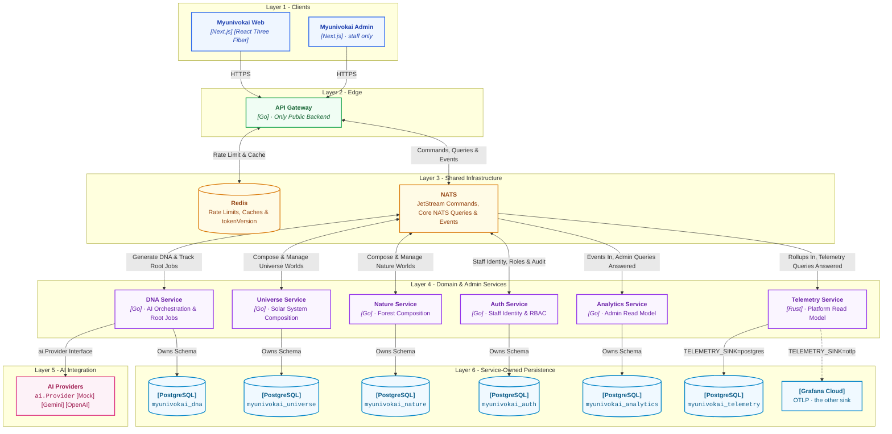
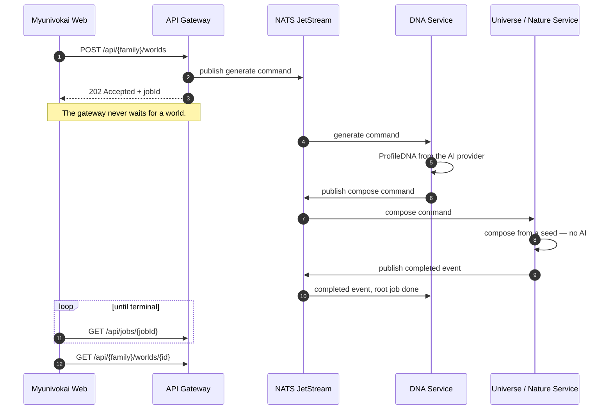

# Myunivokai

AI-powered personal 3D universe generator.

A visitor describes themselves once.
The platform creates a canonical ProfileDNA from that input.
Then it composes a **Universe** (Solar System) or a **Nature** (Forest) world
and renders it as an interactive 3D scene right in the browser.

---

## Architecture



- The diagram shows ownership, not request sequence.
- Each service owns its own PostgreSQL database; nothing reads another's tables.
- Redis belongs to the gateway alone — caching and rate limits, never job queuing.
- Only the gateway is public; NATS, Redis and every service in Layer 4 are private.
- Layer 4 are NATS workers with no HTTP business API — each binds a port only
  so a scale-to-zero host has something to cold-start against.
- **Analytics and Telemetry are the only single-headed arrows.** Every other
  service both receives commands and publishes back; these two consume events
  and answer admin queries but publish no domain subject, so an admin page
  never waits on, or wakes, a domain service the free tier may have put to
  sleep.
- **Telemetry is the only service not written in Go, and the only one with two
  possible destinations.** `TELEMETRY_SINK` picks its own PostgreSQL schema or
  Grafana Cloud at startup — one `match`, not a fork. Why Rust, and why this
  service, is answered in
  [notes/vision/rust-adoption-research.md](notes/vision/rust-adoption-research.md).
- AI providers sit behind `dna-service` alone — no other service calls one.

| Service | What it does |
| --- | --- |
| `services/api-gateway` | The only public-facing backend. Validates input, publishes commands to NATS, returns `202 + jobId`, and manages Redis caching. |
| `services/dna-service` | Handles AI orchestration, root generation jobs, ProfileDNA versioning, and the transactional outbox. |
| `services/universe-service` | Computes deterministic solar-system worlds and variants from a seed. No AI calls. |
| `services/nature-service` | Computes deterministic forest worlds and variants from a seed. No AI calls. |
| `services/ocean-service` | Computes deterministic ocean worlds from a seed and a depth. Water, fog and light come from a measured attenuation curve and are stored, never recomputed. No AI calls. |
| `services/auth-service` | Staff identity: login, refresh, roles, permissions, audit. Core NATS request-reply only. |
| `services/analytics-service` | The admin read model. Consumes events, writes its own database, answers admin queries — it publishes nothing and calls no other service, so an admin page waits only on the gateway, auth and analytics. |
| `services/telemetry-service` | **[Rust]** The platform read model. Consumes one aggregated rollup envelope per minute from the gateway and answers telemetry queries — request volume, per-route latency, per-backend round trips, cache hit rate. Stores them in its own schema or forwards them to Grafana Cloud, chosen by one environment variable. |
| `contracts` | Shared OpenAPI spec, JSON Schemas, NATS subject names, and Go types used across services. |
| `infra` | Local development infrastructure: PostgreSQL, NATS JetStream, Redis, ACL config, and bootstrap scripts. |

---

## How a request travels

The diagram above shows ownership. This one shows sequence — the single path
that matters, from a visitor pressing a button to a world existing.



Everything after step 3 is asynchronous. The frontend's polling loop is what
turns it back into something that feels synchronous.

The rest of the request path — what can be done to a world afterwards, which
Redis key is invalidated by what, how the admin app reads data it may never
query directly, and what `no-responders` means on a scale-to-zero plan — is in
[notes/be/request-lifecycle.md](notes/be/request-lifecycle.md).

Three decisions that shape more of this codebase than their size suggests —
AI touching only the semantic layer, every world playing real public-domain
music, and one interface per external vendor — are in
[notes/be/design-decisions.md](notes/be/design-decisions.md).

---

## Core concepts

| Concept | What it means |
| --- | --- |
| **ProfileDNA** | The AI-generated semantic profile: archetype, narrative, traits, energy, facets, palette intent, atmosphere. This is the only thing AI produces. |
| **World Seed** | A deterministic seed computed by the backend. Same seed = same 3D scene. No randomness in rendering code. |
| **World Scene Config** | The full numeric recipe for a 3D scene (planets, orbits, lighting, palette, mood). Computed from the seed, completely AI-free. |
| **Variant** | An alternative scene config for the same world. Generated from a new seed at zero AI cost. One variant is marked as the selected one. |
| **Mood Scene Profiles** | Per-mood rendering parameters, mirrored in both Go and TypeScript to keep visuals consistent. |
| **Share Slug** | Publishing mints one permanent slug per world. Republishing reuses it. |
| **Ambient Soundscape** | The music a world plays: a public-domain score performed by recorded instrument samples, with the piece, the instruments, the tempo, the key and the chord density all resolved from the DNA and the seed. |
| **Rare Features** | Black hole, binary suns, meteor shower. Rolled on the frontend from the seed, never stored, so the same seed must reach every page. |
| **Async Job & Polling** | Gateway returns `202 + jobId`. Frontend polls `GET /api/jobs/{jobId}` until the result is ready. |

---

## Tech stack

### Backend

| Technology | Role |
| --- | --- |
| **Go** | All backend services |
| **chi** | HTTP router (API Gateway) |
| **pgxpool** | PostgreSQL connection pooling — every service (DNA, Universe, Nature, Auth, Analytics) |
| **NATS JetStream** | Durable command/event messaging between services |
| **Core NATS** | Lightweight request-reply queries |
| **Redis** | Rate limiting and response caching (Gateway); `tokenVersion` cache (Auth) |
| **zerolog** | Structured JSON logging |

### Frontend

`myunivokai-web` and `myunivokai-admin` are two independent Next.js apps that
share no code — the import-boundary check
(`apps/myunivokai-admin/scripts/check-import-boundary.mjs`) is what keeps them
from drifting into doing so. Since 2026-08-14 they are on the same major:
the admin app went to Next 15 first deliberately, as the proving ground for the
upgrade the 3D app owed, and the 3D app has now followed it.

**`myunivokai-web`** — Next.js 15, React 19

| Technology | Role |
| --- | --- |
| **Next.js 15** | App Router, SSR, API route proxies |
| **React 19 + TypeScript** | UI components and type safety |
| **React Three Fiber** | three.js integration for 3D rendering |
| **@react-three/drei** | three.js helpers and abstractions |
| **@react-three/postprocessing** | Post-processing effects (bloom, vignette) |
| **Web Audio API** | Ambient music: sampled instruments, convolution reverb, lookahead scheduling |
| **Tailwind CSS 3** | Styling with custom design tokens (Vitrine + Liquid Glass) |
| **vitest** | Unit testing |
| **Playwright** | Scene screenshots — not a test suite. `npm run shoot` photographs both families against committed reference images in `e2e/reference/`, because nothing else here can see the canvas |

**`myunivokai-admin`** — Next.js 15, React 19

| Technology | Role |
| --- | --- |
| **Next.js 15** | App Router, Server Components, staff-only console |
| **React 19 + TypeScript** | UI components and type safety |
| **@base-ui/react** | Headless primitives (select, menu, dialog) behind the shadcn `base-nova` style |
| **@tanstack/react-query** | Server-state cache, cursor pagination, mutation invalidation |
| **motion** | Sidebar and content-transition animation |
| **recharts** | Dashboard charts (worlds/jobs distributions, timeseries) |
| **Tailwind CSS 4** | Styling — dark liquid-glass theme, isolated from the web app's tokens |
| **vitest** | Unit testing |

### Infrastructure

| Technology | Role |
| --- | --- |
| **PostgreSQL 17** | 3 isolated databases, one per domain service |
| **Neon** | Managed PostgreSQL hosting (production) |
| **NATS 2.11** | Managed messaging (production) |
| **Redis 7.4** | Managed cache (production) |
| **Docker Compose** | Local full-stack development |
| **Render** | Production hosting (web services + background workers) |
| **GitHub Actions** | CI quality gates on every PR |

---

## Prerequisites

- **Docker Desktop** with Compose v2.20+ (required for local development).
- **Go 1.23+** — only needed if running backend services outside Docker.
- **Node.js 20+** with npm — only needed if running frontend outside Docker.

---

## Run locally — full stack

Everything in Docker: databases, messaging, all backend services, the frontend.

**Step 1.** Copy the environment template (skip if `.env.local` already exists):

```powershell
cp .env.example .env.local
```

- The repo ships a working `.env.local` with local-only credentials.

**Step 2.** Start all services:

```powershell
docker compose --env-file .env.local -f docker-compose-local.yaml up --build
```

- `--env-file .env.local` is **required**, not cosmetic.
- Compose auto-loads a root `.env` when the flag is absent.
- A root `.env` outranks the `env_file:` entries under `include:`.
- Anyone holding a deploy-shaped `.env` then boots the local stack against
  production NATS, production Redis and the live AI provider — silently.
- Verify what you are about to start: `docker compose --env-file .env.local -f docker-compose-local.yaml config`.
- `make local-up` passes the flag for you.

**Step 3.** Wait for the containers to report healthy, then open:

| Component | URL |
| --- | --- |
| Web (frontend) | http://localhost:41300 |
| Admin (staff console) | http://localhost:41900 |
| API Gateway | http://localhost:41800 |
| Liveness probe | http://localhost:41800/api/v1/healthz |
| Readiness probe | http://localhost:41800/api/v1/readyz |

**Step 4.** Create the first staff account — nothing can log into the admin
console until one exists, and there is no self-signup anywhere in the system:

```powershell
docker compose --env-file .env.local -f docker-compose-local.yaml exec auth-service go run ./cmd/bootstrap --email admin@myunivokai.local --password "ChangeMe12345Local"
```

- Creates one **super admin** account directly in `myunivokai_auth` — every
  permission, always (see `services/auth-service/README.md`).
- Safe to run again later with a different `--email` to create additional
  accounts; it does not touch or reset any existing account.
- Log in at http://localhost:41900/login with `admin@myunivokai.local` / `ChangeMe12345Local` (or whatever you passed above).

**Step 5.** Stop everything:

```powershell
make local-down
```

### Published ports

- Deliberately off the usual numbers so the stack never fights another project.
- Nothing here uses `3000`, `8080`, `5432`, `6379` or `4222` on the host.
- Change any of them in `.env.local`; the compose files read the variables.

| Host port | Service | Container port |
| ---: | --- | ---: |
| 41300 | Web (frontend) | 41300 |
| 41900 | Admin (staff console) | 41900 |
| 41800 | API Gateway | 41800 |
| 15432 | PostgreSQL | 5432 |
| 14222 | NATS client | 4222 |
| 18222 | NATS monitoring | 8222 |
| 16379 | Redis | 6379 |

- Domain services publish no host port at all — they are NATS workers.
- Production ports come from the platform's `PORT`, untouched by these values.

---

## Run locally — single service

For iterating on one service while infrastructure runs in Docker.

**Step 1.** Start shared infrastructure only:

```powershell
docker compose --env-file infra/.env.local -f infra/docker-compose-local.yaml up -d
```

**Step 2.** Start the service you are working on (example: universe-service):

```powershell
docker compose --env-file services/universe-service/.env.local `
  -f services/universe-service/docker-compose-local.yaml up --build
```

- Each service compose file joins the shared `myunivokai-local-backend` network.
- Each expects infrastructure to be running already.
- The frontend outside Docker: `cd apps/myunivokai-web; npm run dev` (port 41300).

---

## Environment files

- `.env.local` holds real local-only values and is tracked in git.
- `.env.example` is the template with placeholders.
- A root `.env` is gitignored and belongs to whoever deploys — never to the stack.
- **Never** put managed or production secrets in `.env.local`.

### Which file is used where

| Environment file | Loaded by | What it configures |
| --- | --- | --- |
| `.env.local` (root) | Root `docker-compose-local.yaml` | Everything. Master config for all services + infra in full-stack mode. |
| `infra/.env.local` | `infra/docker-compose-local.yaml` | PostgreSQL, NATS, and Redis only. Used when running infra standalone. |
| `services/api-gateway/.env.local` | `services/api-gateway/docker-compose-local.yaml` | NATS connection, Redis, rate limits, cache TTLs. |
| `services/dna-service/.env.local` | `services/dna-service/docker-compose-local.yaml` | Database, NATS, AI provider config, API keys. |
| `services/universe-service/.env.local` | `services/universe-service/docker-compose-local.yaml` | Database, NATS, outbox settings. |
| `services/nature-service/.env.local` | `services/nature-service/docker-compose-local.yaml` | Database, NATS, outbox settings. |
| `services/ocean-service/.env.local` | `services/ocean-service/docker-compose-local.yaml` | Database, NATS, outbox settings. |
| `services/auth-service/.env.local` | `services/auth-service/docker-compose-local.yaml` | Database, NATS, Redis, token and Argon2id settings. |
| `services/analytics-service/.env.local` | `services/analytics-service/docker-compose-local.yaml` | Database, NATS, event-consumer settings. No credentials — it verifies no token and calls no provider. |
| `services/telemetry-service/.env.local` | `services/telemetry-service/docker-compose-local.yaml` | Sink selection, database, NATS, retention. No credentials, for the same reason. |
| `apps/myunivokai-web/.env.local` | Web compose file and `npm run dev` | Just `NEXT_PUBLIC_GATEWAY_BASE_URL`. |

### How full-stack mode resolves variables

- The root `docker-compose-local.yaml` is an `include:` aggregator, nothing more.
- Each `include:` entry names the root `.env.local` for interpolation.
- Each child compose file also loads its own `.env.local` via `env_file:`.
- Root-level variables win over child ones through Compose interpolation.
- A root `.env` wins over all of it, which is why the `--env-file` flag matters.

### Why NATS credentials are prefixed in the root file

- One root file has to hold credentials for every service at once.
- Prefixed names (`NATS_GATEWAY_USERNAME`) avoid collisions between them.
- Each service compose file maps the prefixed name to the plain one its binary reads.

```yaml
# In services/api-gateway/docker-compose-local.yaml:
environment:
  NATS_USERNAME: ${NATS_GATEWAY_USERNAME:-myunivokai_gateway}
  NATS_PASSWORD: ${NATS_GATEWAY_PASSWORD:-myunivokai_local_gateway}
```

### Production

- Render sets every variable through its dashboard; `render.yaml` lists which.
- Database URLs, NATS URLs and API keys are configured per service, by hand.
- The service port comes from Render's `PORT`, so local port choices never leak.

---

## Repository layout

```txt
.
├── AGENTS.md                         # Agent instructions and stack rules
├── Makefile                          # Build and test shortcuts
├── render.yaml                       # Render deployment blueprint
├── docker-compose-local.yaml         # Root aggregator for local full-stack development
├── .env.example                      # Full-stack environment template
├── apps/
│   ├── myunivokai-web/               # Next.js 14 + React Three Fiber frontend
│   │   ├── .env.example              # Template: NEXT_PUBLIC_GATEWAY_BASE_URL
│   │   ├── Dockerfile.prod           # Production container
│   │   ├── public/                   # Static assets: GLB models, textures, audio samples and scores
│   │   └── src/
│   │       ├── app/                  # App Router pages and API route proxies
│   │       ├── components/           # Shared UI components (Vitrine + Liquid Glass)
│   │       ├── features/             # Feature modules and scene renderers
│   │       │   ├── audio/            # Instrument samples, arrangements, the performing graph
│   │       │   └── scene-renderers/  # SceneType registry (solar-system/, forest/, fallback/)
│   │       └── lib/                  # API clients, polling hooks, state utilities
│   └── myunivokai-admin/             # Next.js staff console; shares no code with the web app
│       ├── .env.example              # Template: ADMIN_GATEWAY_BASE_URL
│       ├── scripts/                  # check-import-boundary.mjs (no myunivokai-web, no three.js)
│       └── src/
│           ├── app/                  # Dashboard routes + the BFF relay to /api/admin
│           ├── components/           # Chrome, shadcn primitives, cursor pagination
│           └── features/             # analytics/, accounts/, roles/, audit/
├── services/
│   ├── api-gateway/                  # Public HTTP edge service
│   │   ├── .env.example              # Template: NATS, Redis, rate limits, cache TTLs
│   │   ├── Dockerfile.prod
│   │   ├── cmd/gateway/              # Entry point
│   │   └── internal/                 # Routes, NATS broker, Redis rate limiter, service wake
│   ├── dna-service/                  # AI orchestration background worker
│   │   ├── .env.example              # Template: Database, NATS, AI provider, API keys
│   │   ├── Dockerfile.prod
│   │   └── internal/                 # AI providers, database, validation
│   ├── universe-service/             # Solar-system world generator worker
│   │   ├── .env.example              # Template: Database, NATS, outbox
│   │   ├── Dockerfile.prod
│   │   └── internal/                 # Seed/PRNG math, models, database
│   ├── nature-service/               # Forest world generator worker
│   ├── ocean-service/                # Ocean world generator worker
│   │   ├── .env.example              # Template: Database, NATS, outbox
│   │   ├── Dockerfile.prod
│   │   └── internal/                 # Seed/PRNG math, models, database
│   ├── auth-service/                 # Staff identity worker (Core NATS request-reply only)
│   │   ├── .env.example              # Template: Database, NATS, Redis, tokens, Argon2id
│   │   ├── cmd/bootstrap/            # One-off: create the first super-admin
│   │   └── internal/                 # Accounts, roles, permissions, audit, security
│   ├── analytics-service/            # Admin read model; consumes events, publishes nothing
│   │   ├── .env.example              # Template: Database, NATS, event consumer
│   │   ├── migrations/               # world_projections, job_projections, inbox_messages
│   │   └── internal/                 # Projection writer, SQL aggregates, keyset pagination
│   └── telemetry-service/            # [Rust] Platform read model; the one service not in Go
│       ├── .env.example              # Template: Sink, Database, NATS, retention
│       ├── migrations/               # http_rollups, error_code_rollups, nats_rollups, cache_rollups, inbox_messages
│       └── src/sinks/                # TelemetrySink trait, postgres and otlp adapters
├── contracts/                        # Cross-service API and messaging contracts
│   ├── go/                           # Shared Go types and NATS subject names
│   ├── fixtures/                     # Executable form of each contract; validated in CI
│   ├── openapi.yaml                  # Public REST API specification
│   ├── openapi-admin.yaml            # Staff-only API; deliberately never merged into the public spec
│   ├── scenes/                       # Scene configuration samples
│   └── schemas/                      # JSON Schemas for ProfileDNA
├── infra/                            # Local development infrastructure
│   ├── .env.example                  # Template: PostgreSQL, NATS, Redis credentials
│   ├── docker-compose-local.yaml     # PostgreSQL, NATS JetStream, Redis containers
│   ├── nats/                         # NATS server config and JetStream bootstrap
│   ├── postgres/                     # Init scripts and multi-database setup
│   └── redis/                        # Redis configuration
└── notes/                            # Engineering documentation
    ├── README.md                     # Documentation index
    ├── be/ & fe/                     # Backend and frontend architecture overviews
    ├── coding/                       # Git conventions and coding style rules
    └── vision/ & sprints/            # Architecture specs and sprint plans
```

The layout is designed for growth.
New services like `services/city-service` or new clients like `apps/mobile-app`
can be added without touching existing messaging contracts or database boundaries.
`analytics-service` is the worked example: it was added as a second consumer on
an existing stream, needed no stream or ACL change to receive the new events
(both are already wildcards), and is invisible to `dna-service`, whose consumer
filters on four explicit subjects.

---

## Quality gates

```powershell
# Backend — contracts
cd contracts/go; go test ./...

# Backend — api-gateway
cd ../../services/api-gateway; go test ./...; go vet ./...; go build ./...

# Backend — dna-service
cd ../dna-service; go test ./...; go vet ./...; go build ./...

# Backend — universe-service
cd ../universe-service; go test ./...; go vet ./...; go build ./...

# Backend — nature-service
cd ../nature-service; go test ./...; go vet ./...; go build ./...

# Backend — ocean-service
cd ../ocean-service; go test ./...; go vet ./...; go build ./...

# Backend — auth-service
cd ../auth-service; go test ./...; go vet ./...; go build ./...

# Backend — analytics-service
cd ../analytics-service; go test ./...; go vet ./...; go build ./...

# Backend — telemetry-service (Rust; needs no database and no broker)
cd ../telemetry-service; cargo fmt --check; cargo clippy --all-targets -- -D warnings; cargo test; cargo build --release

# Contracts — the Rust mirror, which decodes the same fixtures the Go suite does
cd ../../contracts/rust; cargo fmt --check; cargo clippy --all-targets -- -D warnings; cargo test

# Frontend — product
cd ../../apps/myunivokai-web; npm run typecheck; npm run lint; npm test; npm run build
npm audit --omit=dev --audit-level=high

# Frontend — admin (check:boundary enforces no myunivokai-web and no three.js)
cd ../myunivokai-admin; npm run typecheck; npm run lint; npm run check:boundary; npm test; npm run build
```

---

## Documentation

Internal engineering docs live in the `notes/` folder.
See [notes/README.md](notes/README.md) for the full index.

Key docs:
- [coding/git-convention.md](notes/coding/git-convention.md) — branch naming and commit format
- [coding/coding-style.md](notes/coding/coding-style.md) — code style rules
- [be/request-lifecycle.md](notes/be/request-lifecycle.md) — generation flow, world lifecycle, cache invalidation, the admin read path, and what `no-responders` means on a sleeping service
- [be/design-decisions.md](notes/be/design-decisions.md) — why AI touches only the semantic layer, why the music is public domain, and the one-interface-per-vendor rule
- [be/source-overview.md](notes/be/source-overview.md) — backend architecture
- [be/rust-service-architecture.md](notes/be/rust-service-architecture.md) — Rust's own conventions, and how the one non-Go service is laid out
- [fe/source-overview.md](notes/fe/source-overview.md) — frontend architecture
- [vision/analytics-service-plan.md](notes/vision/analytics-service-plan.md) — why the admin app reads from a CQRS read model instead of a gateway fan-out
- [vision/telemetry-service-plan.md](notes/vision/telemetry-service-plan.md) — the platform read model, why observability here has to be push-based, and the 7-day retention trap a scale-to-zero read model inherits
- [vision/auth-and-admin-plan.md](notes/vision/auth-and-admin-plan.md) — staff identity, RBAC and the admin route group
- [vision/platform-evolution-research.md](notes/vision/platform-evolution-research.md) — proposals still being argued against the source: end-user ownership across two databases, WebGPU, and what shipped out of the earlier tracks
- [ops/production-deployment-guide.md](notes/ops/production-deployment-guide.md) — step-by-step production deploy runbook
- [fe/ambient-audio-mechanism.md](notes/fe/ambient-audio-mechanism.md) — how the music is made, and how to audition it
- [contracts/openapi.yaml](contracts/openapi.yaml) — API specification
