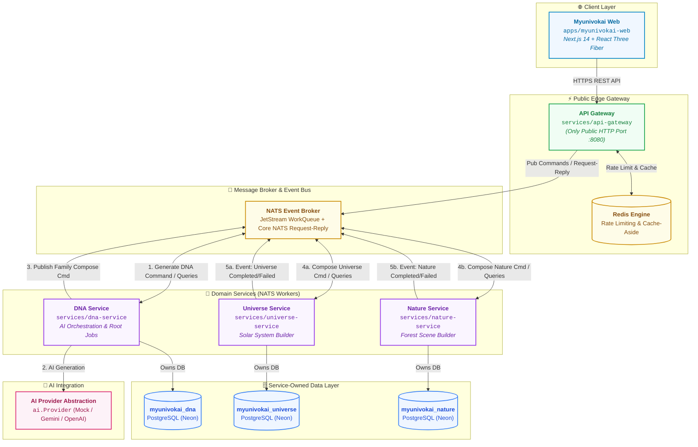

# Myunivokai

Myunivokai is an AI-powered personal 3D universe generator. A visitor describes themselves once; the platform creates canonical ProfileDNA and composes interactive 3D worlds (Solar Systems or Nature Forests) using Next.js, Three.js, Go microservices, NATS JetStream, Redis, and Neon PostgreSQL.

## Architecture



### Core Components

- `apps/myunivokai-web`: Next.js 3D web application built with React Three Fiber and Tailwind CSS.
- `services/api-gateway`: Single public edge entry point (`:8080`); handles REST API validation, Redis rate limiting/caching, and NATS message dispatching.
- `services/dna-service`: Manages raw user input, root generation jobs, AI provider abstraction (`ai.Provider`), and immutable ProfileDNA.
- `services/universe-service`: Seed-deterministic solar system scene generator and variant engine.
- `services/nature-service`: Seed-deterministic forest/nature scene generator and variant engine.
- `contracts`: OpenAPI specs, JSON schemas, NATS fixtures, and shared Go data types.
- `infra`: Local development environment configurations for PostgreSQL, NATS JetStream, and Redis.

## Run Locally

**Requirement**: Docker Desktop with Compose 2.20+.

```powershell
# Start complete local stack
docker compose -f docker-compose-local.yml up --build
```

### Public & Diagnostic Endpoints

| Component | URL / Endpoint |
| --- | --- |
| Web Application | <http://localhost:3000> |
| API Gateway | <http://localhost:8080> |
| Gateway Health Check | <http://localhost:8080/api/v1/healthz> |
| NATS Monitoring | <http://localhost:18222> |
| NATS Client | `nats://localhost:14222` |
| PostgreSQL Diagnostics | `localhost:15432` |
| Redis Diagnostics | `localhost:16379` |

## Quality Gates

Run quality verification across all modules:

```powershell
# Backend Verification
cd contracts/go; go test ./...
cd ../../services/api-gateway; go test ./...; go vet ./...; go build ./...
cd ../dna-service; go test ./...; go vet ./...; go build ./...
cd ../universe-service; go test ./...; go vet ./...; go build ./...
cd ../nature-service; go test ./...; go vet ./...; go build ./...

# Frontend Verification
cd ../../apps/myunivokai-web; npm run typecheck; npm run lint; npm test; npm run build
```

## Documentation & Contracts

- **Internal Docs Index**: [notes/README.md](notes/README.md)
- **Architecture Baseline**: [Vision V1](notes/vision/versions/v1-2026-07-22/README.md)
- **API Contract**: [contracts/openapi.yaml](contracts/openapi.yaml)
- **Render Deployment**: [notes/ops/render-deployment.md](notes/ops/render-deployment.md)
